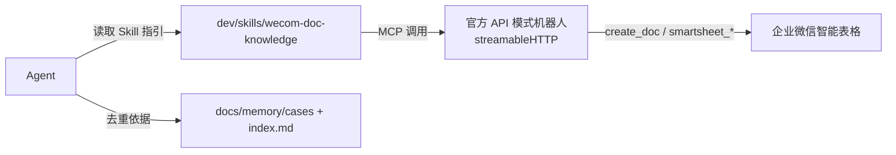

## 用户需求

将现有 `wecom-doc-knowledge` 方案从「自建应用 + corp_secret」改为「官方 API 模式机器人」对接企业微信文档。

**背景**：用户没有企业微信管理员权限，无法在「协作→文档→API」配置可调用应用（自建应用方式卡死）。API 模式机器人由成员自行授权「文档」权限即可（7 天有效期，可续期），原生支持 MCP（streamableHTTP URL / JSON Config），无需管理员、无需自写 Python MCP。

## 核心变更

- 删除自写的 `wecom-doc-mcp` Python 工程（无管理员场景已无意义）
- 改写 `dev/skills/wecom-doc-knowledge/` 四个文件，使其描述「官方 API 模式机器人 MCP」的使用方式
- 工具调用名从自建 MCP 工具（`add_record`/`search_records`/`list_spaces` 等）切换为官方机器人工具（`create_doc`/`smartsheet_add_records`/`smartsheet_add_sheet`/`smartsheet_get_fields` 等）
- 去重第三层（在线查询）受官方机器人工具能力限制（仅 create / get / add 系列，无精确搜索/列表），需明确降级为「本地 case 元数据 + index 两层为主，在线层尽力而为」
- `docs/memory/index.md` 的 `wecom_record_id` 列保留，作为本地回写标识继续有效

## 功能内容

- Agent 通过 IDE 中配置的官方机器人 MCP，向企业微信智能表格写入/更新 HIS 经验 case
- 保留三重去重逻辑，但第三层在线查询降级为「先用 `smartsheet_get_fields`/`smartsheet_get_sheet` 确认结构，再用 `smartsheet_add_records` 写入时本地比对禅道号」，不再依赖服务端精确搜索
- Skill 文档提示用户：机器人在企业微信「工作台→智能机器人」授权，7 天过期需重新点授权

## 技术栈

- 复用官方「企业微信 API 模式机器人」原生 MCP（streamableHTTP 传输），不引入任何自写代码
- 配置方式：IDE MCP 设置中填入机器人授权后提供的 streamableHTTP URL 或 JSON Config
- 鉴权：成员在企业微信客户端授权机器人「文档」权限（有效期 7 天），授权后机器人成为其创建文档的拥有者

## 实现方案

### 策略

废弃自写 Python MCP，完全切换为官方机器人 MCP。Skill 文档从「教 Agent 调 wecom-doc-mcp 工具」改为「教 Agent 调官方机器人 MCP 工具」，同时根据官方工具能力差异调整去重实现。

### 关键决策与权衡

1. **删除 `wecom-doc-mcp/`**：该目录为 git untracked，删除零风险，且在新方案下完全无用（官方机器人自带 MCP，无需自写 server）。
2. **工具名映射**：

- `add_record` → `smartsheet_add_records`
- `update_record` → 官方机器人当前无独立 update 工具，改用「`smartsheet_get_fields` 取结构 + `smartsheet_add_records` 追加新记录并本地标注版本」，或在文档内容中追加改造记录（与 ima-knowledge 的 update 语义对齐，接受智能表格内多版本记录）
- `search_records`/`search_by_keyword`/`list_records` → 官方无搜索/列表工具；降级为本地 `index.md` + case 元数据两层去重为主，在线层仅用 `smartsheet_get_sheet`/`smartsheet_get_fields` 确认结构后由 Agent 读取已有记录做本地禅道号比对（若记录量大则提示用户人工确认）
- `create_smart_table` → `create_doc(doc_type=10)`
- `get_doc_info`/`rename_doc`/`delete_doc`/`set_doc_permission` 等 → 官方机器人未提供，文档中标注「不支持，需在企业微信客户端手动操作」

3. **space_id 移除**：官方机器人模式下无微盘 space 概念，文档由机器人直接创建，classification.md 与 SKILL.md 中所有 space_id / list_spaces / list_folders 引用删除。
4. **7 天授权**：SKILL.md 前置检查与常见错误中明确「授权过期 → 在企业微信重新授权机器人文档权限」。

### 实现注意

- 所有改写仅限 `dev/skills/wecom-doc-knowledge/` 四个 md 文件 + 删除 `dev/mcp/wecom-doc-mcp/` 目录
- `docs/memory/index.md` 已加的 `wecom_record_id` 列**保留不动**（本地回写标识仍有效）
- 官方工具参数以企业微信文档 101468 为准，示例需用真实参数形态（docid、sheet_id、fields 数组等）
- 避免在 Skill 中承诺官方机器人不具备的能力（精确搜索、权限管理、空间管理）

## 架构设计

无新增代码架构。Skill 作为「使用说明层」指导 Agent 调用官方机器人 MCP。数据流：



## 目录结构

```
fj-common/
├── dev/skills/wecom-doc-knowledge/
│   ├── SKILL.md          # [MODIFY] 改为官方 API 模式机器人 MCP 描述；移除 .env/space_id/list_spaces 引用；改写工作流 A/B/C 工具名；改写常见错误为授权类
│   ├── mcp-tools.md      # [MODIFY] 整文件重写为官方机器人工具速查（create_doc / edit_doc_content / smartsheet_add_sheet / smartsheet_get_sheet / smartsheet_add_fields / smartsheet_update_fields / smartsheet_get_fields / smartsheet_add_records），附官方参数示例与能力边界说明
│   ├── classification.md  # [MODIFY] 移除 space_id 与 list_spaces 引用；写入示例 add_record → smartsheet_add_records；维护节改为 create_doc 创建
│   └── dedup.md          # [MODIFY] 第 3 层在线去重改为官方工具降级策略；add_record/update_record 引用改为 smartsheet_add_records；检查清单同步
└── dev/mcp/wecom-doc-mcp/   # [DELETE] 整个目录删除（git untracked，含 src/ 13 个 .py、pyproject.toml、README.md、.env.example）
```

## Agent Extensions

### Skill

- **skill-creator**
- 用途：参照 skill 创建规范，确保改写后的 `wecom-doc-knowledge` Skill 结构、frontmatter、引用链接符合标准
- 预期结果：四个 md 文件格式规范、frontmatter description 准确触发、内部交叉引用（dedup.md / classification.md / mcp-tools.md）无误