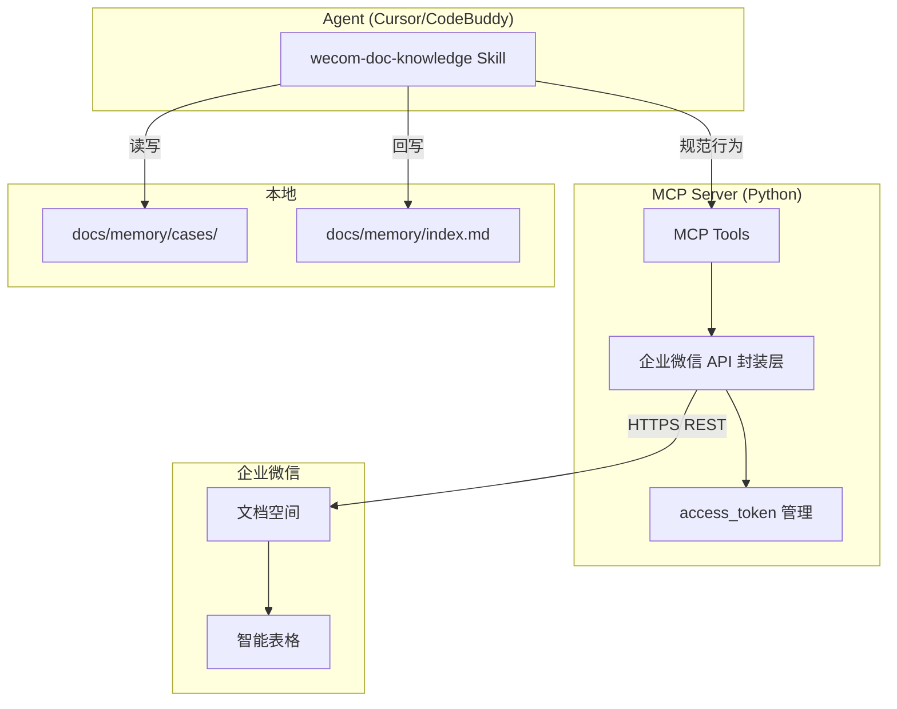

## 用户需求

创建一套 Skill + MCP 组合，对接企业微信文档（而非腾讯文档 docs.qq.com），实现团队记忆的在线沉淀和共享。行为模式参考现有的全局 Skill `ima-knowledge`，将 `docs/memory/cases/` 中的经验案例同步写入企业微信空间。

## 产品概述

"企业微信文档知识库"（wecom-doc-knowledge）是一套 Skill + MCP 的组合系统：

- **Skill**（`wecom-doc-knowledge`）：定义工作流、去重策略、分类映射、与现有 workflow 的衔接规范
- **MCP**（`wecom-doc-mcp`）：封装企业微信文档 API，提供智能表格的增删改查、检索、权限管理能力

与 ima-knowledge 的关系是**互补**：IMA 用于个人在线检索，企业微信文档用于团队内共享沉淀。

## 核心功能

1. **智能表格存储**：使用企业微信智能表格作为知识库后端，按分类分表（需求开发表、问题排查表），字段包括禅道号、标题、分类、业务域、内容摘要、创建日期、关联 case 文件
2. **三重去重**：本地 case 元数据 → 本地 index.md → 智能表格按禅道号查询，任一层命中则跳过新建
3. **三种工作流**：A 在线检索（Step 4 记忆召回）、B Step 12 同步沉淀（本地 case 写完后自动同步）、C 用户点名上传
4. **回写机制**：上传成功后自动回写 case 元数据（wecom_docid、wecom_record_id）和 index.md
5. **分类映射**：category（需求开发/问题排查）+ domain（收费&医保/医嘱&药剂/其他）→ 对应智能表格子表
6. **权限管理**：通过企业微信应用权限控制文档的访问范围

## 技术栈选择

| 层次 | 技术选型 | 理由 |
| --- | --- | --- |
| MCP 实现语言 | **Python 3.10+** | 复用企业微信文档 API 生态（wecom-doc-sdk 参考），与现有 Node.js MCP 并行 |
| MCP 框架 | **mcp** (Python SDK, `pip install mcp`) | 官方 Python MCP SDK，与 Node.js MCP SDK 对等 |
| HTTP 客户端 | **httpx** | 异步支持，连接池复用，企业微信 API 标准客户端 |
| 企业微信 SDK | **直接调用官方 REST API**（参考 wecom-doc-sdk v0.7.1 的设计） | wecom-doc-sdk 为 Alpha 实验阶段，不用于生产；直接调用 API 更稳定可控 |
| 数据格式 | Pydantic v2 | 请求/响应建模，类型校验 |
| 配置管理 | `.env` 文件 + JSON 配置文件 | 与现有 zoe-his-mcp 的配置模式一致 |


## 实现方案

### 总体策略

采用 **Skill 定义规范 + MCP 封装 API** 的分层架构：

- **Skill 层**：纯文档定义，规范 Agent 行为（类似 ima-knowledge 的 SKILL.md + dedup.md + classification.md）
- **MCP 层**：Python MCP Server，封装企业微信文档 API 为标准化工具

存储后端选择**智能表格**而非在线文档，原因：

1. 字段化存储（禅道号、标题、分类、内容等），天然支持结构化检索
2. 支持按字段查询（如按禅道号查重），比全文搜索更精确
3. 企业微信空间 → 文件夹 → 智能表格的层级天然适合知识库组织

### 企业微信文档 API 对接方案

```
企业微信空间 (Space)
├── 文件夹: HIS经验库 (通过 API 创建)
│   ├── 智能表格: 需求开发 (子表=业务域: 收费&医保/医嘱&药剂/其他)
│   └── 智能表格: 问题排查 (子表=业务域)
```

**智能表格字段设计**：

| 字段名 | 类型 | 说明 |
| --- | --- | --- |
| 禅道号 | 文本 | 主键，用于去重查询 |
| 标题 | 文本 | `[禅道号] 功能描述` |
| 分类 | 单选 | 需求开发 / 问题排查 |
| 业务域 | 单选 | 收费&医保 / 医嘱&药剂 / 其他 |
| 内容摘要 | 长文本 | Markdown 正文摘要 |
| 关联 case 文件 | 文本 | `cases/xxx.md` 路径 |
| 创建日期 | 日期 | YYYY-MM-DD |
| wecom_record_id | 文本 | 记录 ID（用于回写） |


### 关键设计决策

1. **不与 ima-knowledge 耦合**：两者独立运行，Agent 在 Step 12 可同时同步到 IMA 和企业微信文档
2. **去重键使用禅道号**：与 ima-knowledge 一致，保持全局唯一性
3. **MCP 工具粒度**：按企业微信 API 模块划分（文档管理、表格内容、权限），每个工具封装一个 API 操作
4. **错误处理**：统一异常封装（WeComAPIError / WeComRequestError），access_token 自动缓存和提前刷新

## 实现注意事项

### 性能

- access_token 缓存：首次获取后缓存 7200 秒，提前 300 秒刷新，避免每次调用都获取 token
- 智能表格查询：按禅道号字段过滤（精确匹配），避免全表扫描
- httpx 连接池复用：单例 Client，减少 TCP 握手开销

### 日志

- 复用 Python logging 标准库
- 日志级别：INFO（正常操作）、WARNING（去重拦截）、ERROR（API 失败）
- 禁止记录 corp_secret 和 access_token

### 兼容性

- 与现有 zoe-his-mcp 并行运行，互不影响
- case 元数据新增 `wecom_docid` / `wecom_record_id` 字段，与 IMA 的 `IMA note_id` 并存
- index.md 新增 `wecom_record_id` 列，与现有 `IMA note_id` 列并行

## 架构设计



## 目录结构

```
fj-common/
├── dev/
│   ├── skills/
│   │   └── wecom-doc-knowledge/          # [NEW] Skill 目录
│   │       ├── SKILL.md                   # 主 Skill 定义：三种工作流、与 workflow 衔接
│   │       ├── dedup.md                   # 三重去重流程（适配智能表格查询）
│   │       ├── classification.md          # 分类与智能表格/子表映射
│   │       └── mcp-tools.md               # MCP 工具速查（工具名、参数、示例）
│   └── mcp/
│       └── wecom-doc-mcp/                 # [NEW] MCP 目录
│           ├── pyproject.toml             # Python 项目配置
│           ├── .env.example               # 环境变量模板（corp_id, corp_secret, space_id）
│           ├── README.md                  # MCP 使用说明
│           └── src/
│               ├── __init__.py
│               ├── server.py              # MCP Server 入口，注册所有工具
│               ├── client.py              # 企业微信 API 客户端（httpx + token 管理）
│               ├── config.py              # 配置加载（.env + 默认值）
│               ├── exceptions.py          # 统一异常定义
│               ├── models/
│               │   ├── __init__.py
│               │   ├── document.py        # 文档/表格/智能表格 Pydantic 模型
│               │   └── enums.py           # 枚举（DocType, 分类, 业务域）
│               └── tools/
│                   ├── __init__.py
│                   ├── space_tools.py     # 空间/文件夹管理工具
│                   ├── doc_tools.py       # 文档/智能表格 CRUD 工具
│                   ├── record_tools.py    # 智能表格记录增删改查工具
│                   └── search_tools.py    # 检索与去重工具
└── docs/
    └── memory/
        └── index.md                       # [MODIFY] 新增 wecom_record_id 列
```

### 文件详细说明

**dev/skills/wecom-doc-knowledge/SKILL.md** — 主 Skill 定义文件。参照 ima-knowledge 的 SKILL.md 结构，包含：

- 前置检查（MCP 状态、凭证配置）
- 工作流 A（在线检索，Step 4 记忆召回=在线/全部）
- 工作流 B（Step 12 同步沉淀，本地 case 写完后自动同步）
- 工作流 C（用户点名上传）
- 与 fj-common workflow 的衔接映射表
- 常见错误处理

**dev/skills/wecom-doc-knowledge/dedup.md** — 去重流程文件。适配智能表格的三重去重：

- 第 1 层：case 元数据 `wecom_record_id` 非空 → 跳过
- 第 2 层：index.md 同禅道号行 `wecom_record_id` 非 `—` → 跳过
- 第 3 层：MCP 工具按禅道号查询智能表格记录 → 有命中则跳过

**dev/skills/wecom-doc-knowledge/classification.md** — 分类映射文件。定义：

- category（需求开发/问题排查）→ 对应智能表格
- domain（收费&医保/医嘱&药剂/其他）→ 对应子表
- 智能表格字段与 case 元数据的映射关系

**dev/skills/wecom-doc-knowledge/mcp-tools.md** — MCP 工具速查。列出所有 MCP 工具的名称、参数、示例调用。

**dev/mcp/wecom-doc-mcp/src/server.py** — MCP Server 入口。使用 `mcp` Python SDK 创建 Server 实例，注册以下工具：

- `list_spaces` — 列出可用的企业微信文档空间
- `create_smart_table` — 创建智能表格（含字段定义）
- `add_record` — 向智能表格添加记录（上传 case）
- `search_records` — 按禅道号/关键词查询记录（去重用）
- `update_record` — 更新已有记录（改造记录追加）
- `get_record` — 获取单条记录详情
- `delete_record` — 删除记录

**dev/mcp/wecom-doc-mcp/src/client.py** — 企业微信 API 客户端。封装：

- `get_access_token()` — 获取并缓存 token（7200s 有效期，提前 300s 刷新）
- `_request(method, url, **kwargs)` — 统一请求方法（自动注入 token、错误处理）
- 企业微信文档 API 的各端点调用方法

**dev/mcp/wecom-doc-mcp/src/models/document.py** — Pydantic 数据模型：

- `SmartTableRecord` — 智能表格记录模型（禅道号、标题、分类、业务域、内容摘要、关联文件、创建日期）
- `SmartTableField` — 字段定义模型
- `SpaceInfo` — 空间信息模型

**dev/mcp/wecom-doc-mcp/src/models/enums.py** — 枚举定义：

- `DocType` — 文档类型（3=文档, 4=表格, 10=智能表格）
- `Category` — 分类枚举（需求开发、问题排查）
- `Domain` — 业务域枚举（收费&医保、医嘱&药剂、其他）

**dev/mcp/wecom-doc-mcp/src/config.py** — 配置管理：

- 从 `.env` 加载 `WECOM_CORP_ID`, `WECOM_CORP_SECRET`, `WECOM_SPACE_ID`
- 默认智能表格名称、字段定义等常量
- 与现有 `dev-env.json` 模式兼容

**dev/mcp/wecom-doc-mcp/src/exceptions.py** — 异常定义：

- `WeComAPIError(errcode, errmsg)` — 企业微信 API 业务错误
- `WeComRequestError` — 网络请求错误
- `DuplicateRecordError` — 去重命中异常（非致命，用于流程控制）

**dev/mcp/wecom-doc-mcp/src/tools/space_tools.py** — 空间管理工具：

- `list_spaces` — 列出所有空间
- `list_folders` — 列出空间下文件夹
- `create_folder` — 创建文件夹

**dev/mcp/wecom-doc-mcp/src/tools/doc_tools.py** — 文档/智能表格工具：

- `create_smart_table` — 创建智能表格并定义字段
- `get_doc_info` — 获取文档基础信息
- `rename_doc` — 重命名文档
- `delete_doc` — 删除文档

**dev/mcp/wecom-doc-mcp/src/tools/record_tools.py** — 记录 CRUD 工具：

- `add_record` — 添加记录（上传 case）
- `update_record` — 更新记录（改造记录追加）
- `delete_record` — 删除记录
- `get_record` — 获取单条记录

**dev/mcp/wecom-doc-mcp/src/tools/search_tools.py** — 检索工具：

- `search_records` — 按字段值查询记录（去重检索用，按禅道号精确匹配）
- `search_by_keyword` — 全文关键词检索（模糊搜索用）
- `list_records` — 分页列出所有记录

**dev/mcp/wecom-doc-mcp/pyproject.toml** — Python 项目配置：

- 依赖：`mcp`, `httpx`, `pydantic`, `python-dotenv`
- 入口：`wecom-doc-mcp = "src.server:main"`
- Python 版本：>=3.10

**dev/mcp/wecom-doc-mcp/.env.example** — 环境变量模板：

```
WECOM_CORP_ID=your_corp_id
WECOM_CORP_SECRET=your_corp_secret
WECOM_SPACE_ID=your_space_id
```

**docs/memory/index.md** — [MODIFY] 在现有表格中新增 `wecom_record_id` 列，与 `IMA note_id` 列并行，用于记录企业微信文档中的记录 ID。

## Agent Extensions

### Skill

- **skill-creator**
- 目的：参照 ima-knowledge 的成熟模式，创建 wecom-doc-knowledge Skill 的 SKILL.md、dedup.md、classification.md、mcp-tools.md 四个文件
- 预期结果：生成符合项目规范的 Skill 定义文件，包含完整的三重去重流程、分类映射和 MCP 工具速查

### SubAgent

- **code-explorer**
- 目的：在创建 MCP 代码时，探索现有 zoe-his-mcp 的目录结构和配置模式，确保新 MCP 与现有项目风格一致
- 预期结果：确认现有 MCP 的配置文件格式、目录组织方式，作为新 MCP 的参考模板