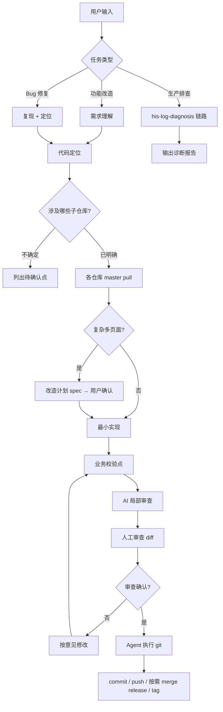

# 福建通用 HIS（fj-common）AI 开发配置与工作流

> 基于 `.trae/` 既有资产甄别整理，面向 **Cursor** 落地。  
> 工作区为 **9 个独立 Git 子仓库** 的聚合目录，**根目录无 Git**。

**日常处理需求请使用 → [workflow.md](workflow.md)（最终版执行清单 + 开场模板）**

**多设备同步 workflow/skill/rule/memory → [multi-device-sync.md](multi-device-sync.md)**

---

## 一、工作区结构（必须先理解）

| 类型 | 仓库 | 业务域 |
|------|------|--------|
| 前端 | `onelink-web-outp-fj-common` | 门诊 |
| 前端 | `onelink-web-pres-fj-common` | 处方 |
| 前端 | `onelink-web-his-charge-fj-common` | 收费 |
| 前端 | `onelink-web-his-drug-fj-common` | 药库 |
| 前端 | `onelink-web-his-fj-component` | 公共组件 |
| 后端 | `onelink-micro-pres-fj-common` | 处方微服务 |
| 后端 | `onelink-micro-charge-fj-common` | 收费微服务 |
| 后端 | `onelink-micro-optimus-fj-common` | 基础/optimus |
| 后端 | `onelink-micro-insurance-fj-ybcommon` | 医保 |

**技术栈（与 `.trae` 一致，已核实）：**

- 前端：Nuxt 2 + Vue 2.6 + zoehis-* + Vuex（核心包）+ SCSS scoped  
- 后端：Spring Boot 2.3 + JDK 11 + MyBatis（`*Dao.xml`）+ 达梦/Oracle  
- 基础设施：Dubbo + Nacos + ZK，Maven 多模块 `api/pojo/service`

**已具备、`.trae` 未写明的增强能力：**

- **Codegraph MCP**：工作区已索引（`.codegraph/`），应用 `codegraph_explore` 做代码定位，替代 dev-workflow 里「待探索 codegraph」的疑问。  
- **HIS 日志 MCP**：生产排查用个人 Skill `his-log-diagnosis` + `user-zoe-his-mcp`（与本地改代码流程分离）。

---

## 二、需要哪些 Rule（Cursor）

`.trae/rules/*.md` 内容 **可直接迁移** 到 `.cursor/rules/*.mdc`，建议 **5 条 alwaysApply**，与 Trae 设计一致。

| 规则文件（建议名） | 来源 | 作用 | 甄别说明 |
|-------------------|------|------|----------|
| `zoehis-naming.mdc` | `naming-convention.md` | 前后端/表命名 | **保留**。Skill 内 `constraints/naming-convention.md` 为详细版，Rule 放精简版即可，避免重复维护时以 Rule 为准。 |
| `zoehis-code-style.mdc` | `code-style.md` | Vue/Java/API/Maven 写法 | **保留**。其中 `D:\dev\...` 路径为个人环境，Rule 中可保留作参考，不要求 Agent 写死路径。 |
| `zoehis-business.mdc` | `business-rules.md` | 池表/主细表/预交金/门诊住院对称 | **保留**。涉及改表、改流水时强制约束。 |
| `zoehis-db-tables.mdc` | `db-table-convention.md` | 表前缀、核心表清单 | **保留**。写 SQL/Dao.xml 时生效；可与 `globs: **/*Dao.xml,**/*.vue` 收窄，但全项目 alwaysApply 更简单。 |
| `zoehis-git-branch.mdc` | `git-branch-convention.md` | master、关键词 merge、项目分支 tag | 已含两阶段与关键词表 |
| `zoehis-test-data.mdc` | （新增） | MCP 测试库造数 | INSERT/UPDATE 仅测试库 |
| `zoehis-code-review.mdc` | （新增） | AI 局部审查 | NPE/SQL/越界 + 幻觉字段 MCP 查表 |

**不建议做成 Rule 的内容：**

| 内容 | 原因 |
|------|------|
| `dev-workflow.md` 全文 | 流程属于 **Skill**，步骤多、分场景，不适合塞进 alwaysApply Rule。 |
| `patterns/*.md`、`examples/*.md` | 参考资料，按需由 Skill 链接，避免每次对话 token 过大。 |
| `frontend-components.md` | 组件 API 体量大，适合 Skill 子文档或按需 Read，不做 alwaysApply。 |
| Cursor 内置 `create-rule` / `create-skill` | 元技能，仅 **搭建配置时** 由人使用，不属于本项目业务 Rule。 |

### Git 与 Agent 边界（两阶段）

`.trae` 工作流默认 Agent 全程自动 git。在 Cursor 中采用 **「先改码、人审、再交 git」** 两阶段：

| 阶段 | 时机 | Agent 可做 | Agent 禁止 |
|------|------|------------|------------|
| **实现期** | 编码至 AI 局部审查结束 | 改代码；各子仓库 `checkout master && pull` | `commit` / `push` / `merge` / `tag` |
| **交付期** | **你审查确认改造无误后** | 按你的指令执行 git（见下） | 未经你确认不得自行提交 |

**Rule（始终生效）：** 开发改动在 **master** 上进行；禁止在 `release-*` 上直接改功能（与 `.trae` 一致）。

**交付期 — 你确认后 Agent 可执行的 git 操作：**

1. 对每个改动过的子仓库：`git add` → `git commit`（`feat:` / `fix:` + 业务描述）→ `git push origin master`  
2. 若你明确要求：合并到 `release-*`、打 tag、生成合并/发版命令  
3. 多仓库时 **逐仓** 执行，并在每步后汇报 `git status`

**触发用语示例（审查通过后）：**

- 「审查通过，提交并 push」→ commit + push master（涉及的全部子仓库）  
- 「提交 master，并合并到 release-1.166」→ 在上述基础上 merge release  
- 「只生成 commit message，我先看」→ 仅起草 message，不执行 git  

**仍建议人工/CI 的步骤（除非你点名让 Agent 做）：** 编译打包、登记测试用例、生产发布。

---

## 三、需要哪些 Skill（Cursor）

### 3.1 项目级（建议放在 `.cursor/skills/`）

| Skill | 来源 | 何时触发 | 甄别结论 |
|-------|------|----------|----------|
| **`zoehis-ai-dev`** | `.trae/skills/zoehis-ai-dev/` | 新功能、改页面、写 Dao、规范检查、业务流程咨询 | **必需**。从 Trae 迁入，改路径引用为 `.cursor/rules` 与本文档。 |
| 子文档（随 Skill 目录迁移） | `docs/dev-workflow.md` | 嵌入 Skill「工作流」章节 | **必需**（内容以本文第四节为准做一次合并更新）。 |
| | `patterns/his-business-patterns.md` | 门诊/住院/收费数据流细节 | **推荐**，比 Rule 更细，按需 Read。 |
| | `patterns/common-patterns.md` | 通用代码模式 | **可选**，覆盖度低时可后补。 |
| | `examples/full-stack-example.md` | 全栈示例 | **骨架**，有真实案例再投喂，不阻塞上线。 |
| | `docs/frontend-components.md` | zoehis 组件用法 | **按需**，改 UI 时再加载。 |
| | `constraints/*.md` | 与 Rule 重复 | **迁移后降级为 reference**，避免双源；或只保留比 Rule 更长的补充段落。 |

**`zoehis-ai-dev` 的 description 建议（Cursor frontmatter）：**

```yaml
name: zoehis-ai-dev
description: >-
  Fujian common HIS (fj-common) full-stack dev: Nuxt/Vue + Spring/MyBatis.
  Use for new features, code review, DB/SQL, outpatient/inpatient/charge/drug flows.
  Follow project rules and docs/ai-dev-setup-workflow.md.
```

### 3.2 个人级（已存在，不迁入仓库）

| Skill | 路径 | 场景 |
|-------|------|------|
| **`his-log-diagnosis`** | `~/.cursor/skills/his-log-diagnosis/` | traceId 排查、日志/SQL/链路、GitLab 读代码（**不用**本地 Grep 代替） |

与 `zoehis-ai-dev` 的分工：

- **改代码 / 做需求** → `zoehis-ai-dev` + 项目 Rules + Codegraph  
- **查生产问题** → `his-log-diagnosis` + `user-zoe-his-mcp`，结论验证前不改代码

### 3.3 不需要为「创建本项目」单独建的 Skill

- `babysit`、`split-to-prs`、`canvas` 等：PR/可视化场景，非 HIS 日常开发必备。  
- `his-log-diagnosis` 已覆盖运维排查，无需在 `.trae` 再复制一份。

---

## 四、统一工作流（甄别后）



### 4.1 需求理解

| 类型 | 动作 |
|------|------|
| 功能改造 | 定业务域（门诊/住院/收费/药库/医保），梳数据流与表 |
| Bug 修复 | 区分本地逻辑错误 vs 环境/数据；有 traceId 可走排查 Skill |
| 问题排查 | **不默认改代码**；走 `his-log-diagnosis` |

**硬约束（来自 `.trae`，保留）：** 业务流程不清时 **列待确认点**，禁止编造表名/接口/流程。

### 4.2 代码定位

| 线索 | 定位方式 |
|------|----------|
| 页面/菜单名 | `pages/{camelCase}/`、`components/{同名}/` |
| 接口 | `api/{kebab-service}/.../{PascalCase}.js` → 后端 Controller |
| 后端 | `Controller → Service → Dao → *Dao.xml` |
| 类名/方法名/SQL | **优先** `codegraph_explore` / `codegraph_search`，避免盲目全库 Grep |
| 生产 traceId | **禁止**仅用本地仓库猜；用 MCP + GitLab `get_code` |

**多仓库清单：** 定位结束时必须写出「将改动哪些仓库」；跨域功能常见组合例如摆药：web-drug + micro-charge。

### 4.3 Git 同步（每个将改动的子仓库）

```bash
cd <子仓库路径>
git checkout master
git pull origin master
```

### 4.4 改造计划（复杂需求必做）

Spec 至少包含：

1. 涉及仓库与文件清单（前/后/Api/Dao.xml）  
2. 涉及表及增删改（池表→记录）  
3. 数据流变更点  
4. 待用户确认的业务问题  

**用户确认后再编码。**

### 4.5 实现要点（与 Rules 一致）

- 前端：Options API、`zoehis-*`、无分号单引号、scoped SCSS、`~/` 别名  
- API：ES6 Class + `$httpVue`  
- 后端：MyBatis `*Dao.xml`，`mappings/{域}/{子域}/`  
- 业务：POOL→执行→RECORD+删 POOL；主细表；预交金+消费流水；`_OUTP_`/`_INP_` 对称  

### 4.6 审查（git 操作的前置关卡）

1. **AI 局部审查**：命名、风格、数据流；**NPE/SQL 异常/索引越界**等风险；**幻觉代码**（存疑 SQL 列名须 MCP `get_table_schema` 核验）  
2. **人工审查**：业务合理性、回归范围；在 diff 上确认或提出修改意见  
3. **未通过审查**：只改代码，**不** 执行任何 git 写操作  

审查通过后，用明确话术进入 **4.7 交付期**（例如：「审查通过，提交并 push」）。

### 4.7 交付与发布（详见 [workflow.md](workflow.md) Step 10–11）

**前置条件：** 人工审查确认。

| 子步 | 说明 |
|------|------|
| 10.1 | push **master**（commit 可含项目关键词） |
| 10.2 | 按 commit 关键词 merge（`【漳州二院】`→`release-1.166`；`【漳州市医院】`→`release-1.168`） |
| 10.3 | 在**项目分支**上 tag = 该分支当前最大 tag +1 |
| 11 | MCP **测试库** INSERT/UPDATE 造数 + SELECT 验证 |

触发语：「审查通过，提交并发布」= 10.1+10.2+10.3；「审查通过，提交并 push」= 仅 10.1。

---

## 五、从 `.trae` 迁移到 Cursor 的检查清单

- [x] 创建 `.cursor/rules/`，5 个 `.mdc`（内容来自 `.trae/rules/`，补 Git Agent 边界段）  
- [x] 创建 `.cursor/skills/zoehis-ai-dev/`，迁移 `SKILL.md` + `docs/` + `patterns/` + `examples/`  
- [x] 更新 Skill 内链接：`.trae/rules` → `.cursor/rules`，工作流 → `docs/dev-workflow.md`  
- [ ] 确认 Codegraph 已 `codegraph init`（本工作区已有 `.codegraph`）  
- [ ] 确认 `user-zoe-his-mcp` 在 Cursor MCP 中启用（排查用）  
- [x] 根目录 `AGENTS.md` 指向本文档与 Skill  
- [x] 根目录 Meta Git + `.gitignore` + [multi-device-sync.md](multi-device-sync.md)  
- [ ] GitHub/GitLab 远程 `fj-common-ai-config` 已 `push`（见 multi-device-sync 第二节）

**可保留 `.trae/`：** 作为 Trae 历史备份，Cursor 以 `.cursor/` 为生效源。

---

## 六、覆盖度与后续投喂（来自 usage-guide，仍成立）

| 维度 | 状态 | 建议 |
|------|------|------|
| 技术栈 | ✅ | 已从 pom/package 提取 |
| 命名/风格 | 🔶 | 以 Rule 为准，遇新模块补 `constraints` 或改 Rule |
| 业务规则 | 🔶 | `his-business-patterns.md` 比 Rule 细，持续投喂案例 |
| 全栈示例 | 🔷 | `full-stack-example.md` 待真实需求完成后填入 |
| 安全/性能 | ⬜ | 需要时新增 Rule 或 Skill 章节，不必预先堆砌 |

---

## 七、快速对照：用户说什么 → 用什么

| 用户意图 | Rule（自动） | Skill / 工具 |
|----------|--------------|--------------|
| 住院摆药加筛选 | 全部 zoehis-* | `zoehis-ai-dev` + Codegraph |
| 这段 Vue 规范吗 | code-style, naming | `zoehis-ai-dev` |
| XX 涉及哪些表 | business, db-tables | `zoehis-ai-dev` + patterns |
| traceId 报错排查 | — | `his-log-diagnosis` + MCP |
| 审查通过，提交并 push | git-branch | 各仓 push master |
| 审查通过，提交并发布 | git-branch | push master → 关键词 merge 项目分支 → 项目分支 tag+1 |
| 审查通过，合并到 release-x.x | git-branch | push master + merge 指定 release（可不打 tag） |
| 测试造数 | zoehis-test-data | MCP 测试库 INSERT/UPDATE + SELECT 验证 |
| 帮我建 Cursor 规则 | — | 人用 `create-rule` skill |

---

*文档版本：2026-06-05（Git 两阶段：人审确认后 Agent 可执行 commit/push 等），依据 `.trae/skills/zoehis-ai-dev` 与 `.trae/rules` 甄别生成。*
