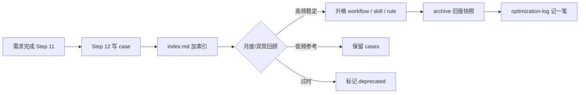

# fj-common 工作经验记忆库

> 把每次需求/排查中**验证过**的经验沉淀下来，定期提炼进 workflow / skill / rule，旧版归档。  
> **权威执行文档仍是** [workflow.md](../workflow.md)；本库是**输入源**，不是替代 workflow。

---

## 为什么需要

| 问题 | 记忆库作用 |
|------|------------|
| 同类需求重复踩坑 | cases 可检索复用 |
| workflow/skill 越写越长 | 只把**高频、稳定**条目升格为 Rule |
| 改 workflow 怕丢历史 | archive 保留每个版本快照 |
| Agent 幻觉 SQL/流程 | 已核实案例作为「待验证假设」参考 |

---

## 目录结构

```
docs/memory/
├── README.md              # 本说明 + 维护周期
├── index.md               # 案例索引（按域/表/页面/关键词）
├── optimization-log.md    # 升格/归档记录（谁、何时、改了什么）
├── cases/
│   ├── _template.md       # 新案例模板
│   └── YYYY-MM-<slug>.md  # 单条经验（一需求或一排查一条）
└── archive/
    └── YYYY-MM-DD/        # 归档的旧 workflow/skill 快照
```

---

## 一条经验的写法（cases）

**只记录已验证事实**，不写猜测。模板见 [cases/_template.md](cases/_template.md)。

必填：

- 背景（禅道号、页面、仓库）
- 根因 / 正确做法
- 涉及表、接口、文件路径
- 是否已升格到 rule/skill/workflow（链接）

---

## 生命周期



### Step 12 — 经验沉淀（需求闭环）

在 [workflow.md](../workflow.md) Step 11 测试造数之后：

1. 若本次有**可复用**经验（新表流转、踩坑、规范补充）→ 新增 `cases/YYYY-MM-<slug>.md`
2. 更新 [index.md](index.md) 一行索引
3. **不**把长文塞进 alwaysApply Rule

### 定期优化（建议双周或每月）

由人发起，Agent 协助整理：

```text
请按 docs/memory/README.md 做经验库回顾：
1. 扫描 cases/ 与 index.md
2. 提议可升格到 workflow / skill / rule 的条目（附理由）
3. 我确认后修改对应文件，并把旧版复制到 docs/memory/archive/YYYY-MM-DD/
4. 更新 optimization-log.md
```

**升格原则：**

| 目标 | 适合内容 | 不适合 |
|------|----------|--------|
| **Rule** | 必须遵守、短、稳定（命名、Git 标题、审查项） | 长篇流程、单次案例 |
| **Skill** | 工作流步骤、模式、示例、组件用法 | 已 alwaysApply 的重复 |
| **workflow** | 门禁、步骤顺序、触发语 | 单个页面改法 |
| **cases** | 具体页面/禅道/表级细节 | 团队已统一的规范 |

---

## 与 his-log-diagnosis 的分工

| 库 | 位置 | 内容 |
|----|------|------|
| 生产排查案例 | 个人 Skill `his-log-diagnosis/cases.md` | traceId、日志、SQL 证伪 |
| **本库** | `docs/memory/cases/` | 功能开发、改码、测试造数、规范演进 |

生产排查结论若影响开发规范，在 case 里加「升格建议」，回顾时再合并进 workflow。

---

## Agent 使用方式

- **新需求前**：Read `index.md`，按页面/表/域搜相关 case
- **需求后**：Step 12 按模板写 case（用户确认后）
- **回顾时**：读全部 cases + 当前 workflow/skill，输出升格提案，**人审后**再改 Rule/Skill

---

## 归档规范

归档目录示例：

```
archive/2026-06-05/
├── workflow.md          # 自 docs/workflow.md 复制
├── zoehis-git-branch.mdc
└── CHANGELOG.md         # 本次变更摘要
```

`optimization-log.md` 记录：

```markdown
## 2026-06-05
- 升格：Git commit 标题规范 → zoehis-git-branch.mdc
- 归档：workflow.md → archive/2026-06-05/
- 新增 case：2026-06-nonMedicalCost-no-default-patient.md
```

---

*维护人：团队 | 与 [workflow.md](../workflow.md) 同步演进*
