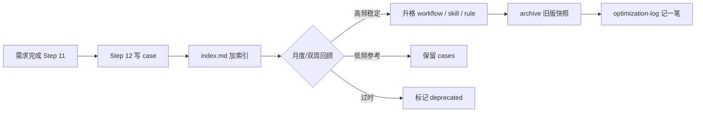

# fj-common 工作经验记忆库

> 把每次需求/排查中**验证过**的经验沉淀下来，定期提炼进 workflow / skill / rule，旧版归档。  
> **权威执行文档仍是** [workflow.md](../workflow.md)；本库是**输入源**，不是替代 workflow。

---

## 为什么需要

| 问题 | 记忆库作用 |
|------|------------|
| 同类需求重复踩坑 | cases 可检索复用 |
| workflow/skill 越写越长 | 只把**高频、稳定**条目升格为 Rule |
| 改 workflow 怕丢历史 | archive 保留每个版本快照 |
| Agent 幻觉 SQL/流程 | 已核实案例作为「待验证假设」参考 |

---

## 目录结构

```
docs/memory/
├── README.md              # 本说明 + 维护周期
├── index.md               # 长期案例索引（按域/表/页面/关键词）
├── optimization-log.md    # 升格/归档记录
├── short-term/            # 短期记忆（需求进行中，交付后删除）
│   ├── README.md
│   └── {禅道号}-{功能描述}+{关键索引}.md   # 中文命名；旧版 {禅道号}-{slug}.md 仍保留
├── cases/                 # 长期记忆（已验证、可复用）
│   ├── _template.md
│   └── {禅道号}-{功能描述}+{关键索引}.md   # 有禅道号时；无号则省略前缀
└── archive/
    └── YYYY-MM-DD/
```

### 短期 vs 长期

| | 短期 `short-term/` | 长期 `cases/` |
|---|-------------------|---------------|
| **内容** | 代码地图、spec 草稿、排查笔记 | 已验证做法、踩坑、表流转 |
| **写入** | Step 4–5；外部分析交接 | Step 12 |
| **删除** | 交付闭环后 Agent 删除 | 保留；过时标 deprecated |
| **index** | 不进入 | 更新 index.md |

---

## 一条经验的写法（cases）

**只记录已验证事实**，不写猜测。模板见 [cases/_template.md](cases/_template.md)。

**IMA 同步标识**（防重复上传）：case 元数据区填写 `IMA 已上传` / `IMA note_id` / `IMA 目录` / `IMA 上传日期`；与 [index.md](index.md) 的 `IMA note_id` 列双重校验。上传与去重见全局 Skill **`ima-knowledge`** 的 `dedup.md`（`~/.cursor/skills/ima-knowledge/`，跨项目通用）。

### 命名与唯一性

| 规则 | 说明 |
|------|------|
| **一禅道一号一文档** | 同一禅道号的后续改造、补丁、返工在**原 case 追加**，禁止同号新建第二份 |
| **中文文件名** | `{禅道号}-{功能描述}+{关键索引}.md`（**有禅道号时文件名与 H1 均含号**） |
| **无禅道号** | 省略 `{禅道号}-` 前缀；H1 仍写功能描述 | `追溯码使用记录查询+traceCodeUsageQuery-医保追溯.md` |
| **文档 H1** | `# [禅道号] {功能描述}` | `# [206301] 入院登记主管医生同步医疗组` |
| **改造记录** | 文档内用「改造记录」表或分节（V1/V2…）区分多次交付 |

必填：

- 背景（禅道号、页面、仓库）
- 根因 / 正确做法
- 涉及表、接口、文件路径
- 是否已升格到 rule/skill/workflow（链接）

---

## 生命周期



### Step 12 — 经验沉淀（需求闭环）

在 [workflow.md](../workflow.md) Step 11 测试造数之后：

1. 若本次有**可复用**经验 → 先按禅道号查 index：**已有 case 则追加**；否则新建 `cases/{禅道号}-{功能描述}+{关键索引}.md`（无禅道号则省略前缀）
2. 更新 [index.md](index.md)（同禅道号保持一行）
3. **不**把长文塞进 alwaysApply Rule

### 定期优化（建议双周或每月）

由人发起，Agent 协助整理：

```text
请按 docs/memory/README.md 做经验库回顾：
1. 扫描 cases/ 与 index.md
2. 提议可升格到 workflow / skill / rule 的条目（附理由）
3. 我确认后修改对应文件，并把旧版复制到 docs/memory/archive/YYYY-MM-DD/
4. 更新 optimization-log.md
```

**升格原则：**

| 目标 | 适合内容 | 不适合 |
|------|----------|--------|
| **Rule** | 必须遵守、短、稳定（命名、Git 标题、审查项） | 长篇流程、单次案例 |
| **Skill** | 工作流步骤、模式、示例、组件用法 | 已 alwaysApply 的重复 |
| **workflow** | 门禁、步骤顺序、触发语 | 单个页面改法 |
| **cases** | 具体页面/禅道/表级细节 | 团队已统一的规范 |

---

## 与 his-log-diagnosis 的分工

| 库 | 位置 | 内容 | 何时写 |
|----|------|------|--------|
| **生产排查 CASE** | `dev/skills/his-log-diagnosis/cases.md` | traceId、日志证伪、防误导模式 | 用户确认可复用后 |
| **开发长期 case** | `docs/memory/cases/` | 改码、造数、规范演进 | workflow Step 12（Bug/功能交付后） |
| **排查 short-term** | — | **禁止** | 排查类不建 short-term |

**召回**：排查类走 [workflow 排查记忆召回](../workflow.md#记忆召回排查专用)（index ≤2 case + cases.md 简表 + 可选 IMA 问题排查），**不走** Step 4 全套代码地图。

生产排查结论若影响开发规范，在 CASE 或开发 case 里加「升格建议」，回顾时再合并进 workflow。

---

## Agent 使用方式

- **新需求前**：Read `index.md`，按页面/表/域搜相关 case；Complex 需求 Step 4 另建 `short-term/` 文件  
- **需求后**：Step 12 写长期 case → 更新 index → **删除** 对应 short-term 文件  
- **回顾时**：读全部 cases + 当前 workflow/skill，输出升格提案，**人审后**再改 Rule/Skill

---

## 归档规范

归档目录示例：

```
archive/2026-06-05/
├── workflow.md          # 自 docs/workflow.md 复制
├── zoehis-git-branch.mdc
└── CHANGELOG.md         # 本次变更摘要
```

`optimization-log.md` 记录：

```markdown
## 2026-06-05
- 升格：Git commit 标题规范 → zoehis-git-branch.mdc
- 归档：workflow.md → archive/2026-06-05/
- 新增 case：2026-06-nonMedicalCost-no-default-patient.md
```

---

*维护人：团队 | 与 [workflow.md](../workflow.md) 同步演进*
