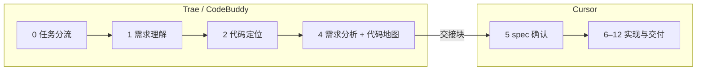

# 多编辑器协作：Trae / CodeBuddy + Cursor

> **原则：Cursor 为主战场**（实现、审查、Git、MCP 造数、长期记忆）；Trae / CodeBuddy 做 **Step 0–4 初步需求分析**，发挥各自优势，**引用不搬运** 配置。

---

## 分工总览

| 阶段 | 推荐编辑器 | 原因 |
|------|------------|------|
| 初步分析、线索整理 | Trae / CodeBuddy | 可并行对话、轻量启动 |
| Spec 定稿、改码、审查 | **Cursor** | Rules 自动生效、MCP、Skill 编排 |
| Git 交付、测试造数 | **Cursor** | `zoehis-git-ops`、测试库 MCP |
| 经验沉淀 | **Cursor** | `docs/memory/cases` + index |

---

## 如何「复用 Cursor 配置」而不搬运

### 1. 引用路径（推荐）

在外部编辑器 system prompt 或用户消息中 **只写路径**，让 Agent Read 仓库内文件：

| 资源 | 路径 | 用途 |
|------|------|------|
| 完整工作流 | `docs/workflow.md` | Cursor 侧权威步骤 |
| 外部分析流程 | `docs/prompt_external.md` | Trae/CodeBuddy 开场模板 |
| 命名/业务规范 | `.cursor/rules/zoehis-*.mdc` | 分析时遵守约束 |
| 代码地图 Skill | `.cursor/skills/zoehis-code-map/SKILL.md` | Step 4 输出格式 |
| 长期记忆索引 | `docs/memory/index.md` | 检索类似需求 |
| 协作说明 | 本文档 | 分工与交接 |

**不要** 把整份 `workflow.md` 或全部 Rule 复制进 Trae 配置仓——仓库即单一事实来源，改一处全员生效。

### 2. MCP

| MCP | Cursor | Trae / CodeBuddy |
|-----|--------|------------------|
| `user-zoe-his-mcp` | ✅ 测试造数、查表结构 | 可选：仅 **SELECT / get_table_schema** 做分析 |
| `user-codegraph` | 可选辅助 | 通常不需要；用 `zoehis-code-map` 即可 |

生产排查仍走个人 Skill `his-log-diagnosis`（linx 工作区），与功能开发分离。

### 3. Skill

- 外部分析：Read **`zoehis-code-map`**（Step 4）
- Cursor 全栈：Read **`zoehis-ai-dev`**（Step 0–12 编排）
- 领域实现：按需 `zoehis-frontend` / `zoehis-backend` / `zoehis-business`

### 4. 记忆库

| 类型 | 目录 | 谁写 | 生命周期 |
|------|------|------|----------|
| **短期** | `docs/memory/short-term/` | 外部分析或 Cursor Step 4–5 | 需求完成后删除 |
| **长期** | `docs/memory/cases/` | Cursor Step 12 | 保留、可升格 |

外部分析产出可先写入 `short-term/{禅道号}-{slug}.md`，Cursor 接手后在此基础上补 spec。

---

## 交接协议（外部 → Cursor）

外部分析结束时，必须输出 **「Cursor 交接块」**（见 `docs/prompt_external.md` 末尾）。Cursor 开场时粘贴该块 + 标准 Cursor 开场模板。

Cursor Agent 收到后：

1. Read 短期记忆文件（若有）
2. 从 **Step 5** 继续：完善 spec → 等人确认 → Step 6 实现
3. **不重复** 外部分析已确认的高置信度代码地图，仅验证低置信度项

---

## 各编辑器可发挥的优势

| 编辑器 | 适合 |
|--------|------|
| **Trae** | 多轮需求澄清、与 `.trae` 历史资产衔接、快速 Grep |
| **CodeBuddy** | 企业内网集成、并行子任务 |
| **Cursor** | alwaysApply Rules、MCP 造数、Git 两阶段交付、AI 局部审查 |

**不限制** 在外部编辑器做更多（例如草拟 spec 草稿），但 **spec 确认与改码** 建议在 Cursor 完成，避免规范/MCP 不一致。

---

## 多设备同步

workflow、skill、rule、memory 通过 Git 同步，见 [multi-device-sync.md](multi-device-sync.md)。  
外部编辑器打开 **同一 fj-common 工作区路径**，即可 Read 相同 `docs/` 与 `.cursor/`。

---

## 快速开始

1. Trae/CodeBuddy：复制 [prompt_external.md](prompt_external.md) 发起需求  
2. 分析完成后复制 **Cursor 交接块**  
3. Cursor：复制 [workflow.md 开场模板](workflow.md#需求开场模板复制给-agent) 并贴上交接块  
4. 在 Cursor 回复「spec 确认」后进入实现

---

*维护：与 [workflow.md](workflow.md) 同步演进*
