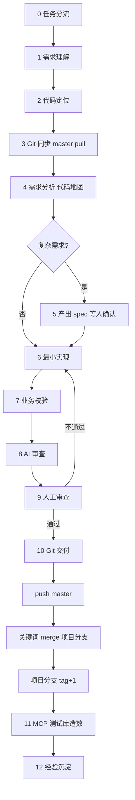

# fj-common 需求处理工作流（最终版）

> **每次处理需求必读。** Agent 须按本文件逐步执行并汇报进度；用户可用文末「开场模板」发起需求。  
> 配置说明见 [ai-dev-setup-workflow.md](ai-dev-setup-workflow.md)；规范由 `.cursor/rules/zoehis-*.mdc` 自动生效。

---

## 进度清单（Agent 每步完成后勾选汇报）

```
需求处理进度:
- [ ] 0. 任务分流（功能 / Bug / 生产排查 / **现场离线排查**）
- [ ] 1. 需求理解（业务域、数据流、待确认点）
- [ ] 2. 代码定位（文件清单 + 子仓库清单）
- [ ] 3. Git 同步（各子仓库 master pull）
- [ ] 4. 需求分析（代码地图 + 记忆库检索；复杂必做，简单可合并到 Step 2 说明）
- [ ] 5. 产出 spec + 用户确认（复杂需求门禁）
- [ ] 6. 最小实现
- [ ] 7. 业务校验（池表/流水/预交金）
- [ ] 8. AI 局部审查（异常风险 + 幻觉/SQL 字段 MCP 核验）
- [ ] 9. 等待人工审查
- [ ] 10. Git 交付：push master → 关键词合并项目分支 → 项目分支打 tag
- [ ] 11. MCP 测试库造数 + 验证（INSERT/UPDATE/SELECT）
- [ ] 12. 经验沉淀（长期 cases + index；清理 short-term）
- [ ] 13. 会话收尾（可选：用户于 Cursor Usage 查看 token）
```

> **外部分析**：Trae / CodeBuddy 仅做 Step 0–4，见 [prompt_external.md](prompt_external.md) 与 [multi-editor-cursor-collab.md](multi-editor-cursor-collab.md)。

---

## 流程总览



---

## Step 0 — 任务分流

| 类型 | 走本工作流？ | 说明 |
|------|--------------|------|
| **功能改造** | ✅ 全流程 | 新需求、增强 |
| **Bug 修复** | ✅ 全流程（可跳过 spec） | 先复现/定位根因 |
| **生产排查** | ❌ 改走排查链路 | Skill `his-log-diagnosis` + MCP `user-zoe-his-mcp`；**验证前不改代码** |
| **现场离线排查** | ❌ 改走 [现场离线排查流程](排查/现场离线排查流程.md) | 库/MCP 生产不可达，凭截图产出 **SELECT 脚本**；**验证前不改代码** |

有 **traceId** 且 MCP 生产可达 → **分支 A**，不走本工作流改码路径。  
现场库不可达、仅有截图/报错 → **分支 B**（见上表链接）。

---

## Step 1 — 需求理解

**Agent 必须输出：**

1. 任务类型（功能 / Bug）  
2. 业务域：门诊 / 住院 / 收费 / 药库 / 医保 / 组件  
3. 参数体系识别（新增/修改开关时必填）：
   - 系统参数 `$getSysParamList`？页面参数 `$getPageControlMap(configId)`？
   - 若已有同页面参数，保持同一体系
   - 不确定时列待确认点
4. 预期数据流（涉及哪些表、池表→记录、预交金/流水）  
5. **待确认点**（业务不清时必填；禁止编造表名、接口、流程）

**硬约束：** 信息不足时只列问题，不开始改代码。

---

## Step 2 — 代码定位

**定位手段（按优先级）：**

1. **长期记忆**：Read [docs/memory/index.md](memory/index.md)，按页面/表/关键词找 cases  
2. 用户线索：页面名、截图、接口名、文件路径  
3. 路径约定：

| 层级 | 路径模式 |
|------|----------|
| 页面 | `pages/{camelCase}/`、`components/{同名}/` |
| API | `api/{kebab-service}/.../{PascalCase}.js` |
| 后端 | `Controller → Service → Dao → *Dao.xml` |

4. **定向 Grep / Read**：小范围符号、路由、`baseUrl`、`dictName`  
5. **Codegraph（可选）**：索引就绪且符号名明确时，`codegraph_explore` 补调用链；非强制，见 Skill `zoehis-code-map`

**Agent 必须输出：**

- 将改动的 **子仓库清单**（见下表）  
- 拟改动 **文件清单**（前/Api/Controller/Service/Dao.xml）  
- 若跨仓：说明调用关系（例：摆药 UI 在 web-drug，接口在 micro-charge）

### 子仓库对照

> **定位方法**：所有子仓库均位于工作区根目录 `{workspaceRoot}/` 下（如 `d:\zoe_work_space\fj-common\onelink-web-pres-fj-common`）。
> **禁止**用 Glob `**/{repo-name}/**` 搜索子仓库（会返回空）。应直接 `LS {workspaceRoot}/{repo-name}/` 或 `Read {workspaceRoot}/{repo-name}/...` 访问。

| 仓库 | 域 | 实际路径 |
|------|-----|----------|
| onelink-web-outp-fj-common | 门诊前端 | `{workspaceRoot}/onelink-web-outp-fj-common/` |
| onelink-web-pres-fj-common | 医嘱前端 | `{workspaceRoot}/onelink-web-pres-fj-common/` |
| onelink-web-his-charge-fj-common | 收费前端 | `{workspaceRoot}/onelink-web-his-charge-fj-common/` |
| onelink-web-his-drug-fj-common | 药库前端 | `{workspaceRoot}/onelink-web-his-drug-fj-common/` |
| onelink-web-his-fj-component | 公共组件 | `{workspaceRoot}/onelink-web-his-fj-component/` |
| onelink-web-cis-common | CIS 公共组件（npm 包） | `{workspaceRoot}/onelink-web-cis-common/` |
| onelink-micro-pres-fj-common | 医嘱后端 | `{workspaceRoot}/onelink-micro-pres-fj-common/` |
| onelink-micro-charge-fj-common | 收费服务 | `{workspaceRoot}/onelink-micro-charge-fj-common/` |
| onelink-micro-optimus-fj-common | 基础服务 | `{workspaceRoot}/onelink-micro-optimus-fj-common/` |
| onelink-micro-insurance-fj-ybcommon | 医保服务 | `{workspaceRoot}/onelink-micro-insurance-fj-ybcommon/` |

**不确定涉及哪个仓 → 列出待确认点，不进入 Step 6。**

---

## Step 3 — Git 同步（实现期）

对 Step 2 列出的 **每个子仓库** 执行：

```bash
cd <子仓库路径>
git checkout master
git pull origin master
```

**实现期禁止：** `commit` / `push` / `merge` / `tag`  
（根目录无 Git，必须进入具体子仓库操作。）

---

## Step 4 — 需求分析

在 Step 2 候选清单基础上，建立 **代码地图** 与业务上下文，供 Step 5 spec 使用。

### 4.1 记忆检索（按优先级）

**记忆召回机制**：根据 prompt 模板中的【记忆召回机制（本地/在线/全部）】选项决定检索范围。

| 选项 | 检索范围 | 说明 |
|------|----------|------|
| **本地** | 仅本地 `docs/memory/` | 不连接 IMA MCP |
| **在线** | 仅 IMA 知识库（MCP `ima-knowledge`） | 不读本地 case 文件 |
| **全部**（默认） | 本地 + IMA 知识库 | 先本地后在线，合并结果 |

#### 本地检索（选项 = 本地 / 全部）

1. **Read `docs/memory/business-rules.md`** → 确认业务约束（如「费用审核人与结算人分离」「手术申请 MASTER+RECORD 双表同步」）
2. **按表名/页面路由查 `docs/memory/index.md` 反向索引** → 找到相关 case
3. **读相关 case 文件** → 获取实现细节和踩坑记录
4. 若无匹配 → 正常分析，交付后沉淀新 case

#### 在线检索（选项 = 在线 / 全部）

对接全局 Skill **`ima-knowledge`**（`~/.cursor/skills/ima-knowledge/SKILL.md`，工作流 A）：

1. 判断当前任务的 category（需求开发/问题排查）+ domain（收费&医保/医嘱&药剂/其他）
2. 调用 `list_kb_content(knowledge_base_id)` 获取文件夹列表
3. 找到对应文件夹的 `folder_id`
4. 调用 `list_kb_content(folder_id=xxx, knowledge_base_id)` 查看历史笔记标题
5. 如有相关笔记，调用 `get_note_content(note_id=xxx)` 读取详情
6. 合并本地与在线结果，去重后输出

#### 检索结果合并（选项 = 全部）

- 本地 case 与在线笔记按**禅道号/关键词**去重
- 输出时标注来源：`[本地]` / `[在线]`
- 若同一 case 本地与在线均有，优先展示本地（内容更完整）

### 4.2 代码地图

**Agent 操作：**

1. Read Skill **`.cursor/skills/zoehis-code-map/SKILL.md`**  
2. 检索 [docs/memory/index.md](memory/index.md) 与相关 cases  
3. 验证调用链（页面 → API → Controller → Service → Dao → 表）  
4. 识别参数体系（系统参数 / 页面参数 / 无）与数据流  
5. **MCP 字段核验（按需）**：涉及表名、拟改 SQL 列、Dao.xml 字段或实体属性且**未从现有代码确认**时，调用 MCP `user-zoe-his-mcp` → **`get_table_schema(tableNamePattern)`**，以返回列名为准写入短期记忆「数据库」或「需求分析要点」；外部分析无法调 MCP 时标「待 Cursor Step 4 MCP 核验」  
6. **复杂需求**：写入短期记忆（命名见下方 **4.3**）  
7. **简单需求**：在回复中说明「Step 4 与 Step 2 合并，跳过短期记忆文件」

### 4.3 短期记忆 / Spec 文档命名（硬约束）

Step 4 分析与 Step 5 spec **共用同一 short-term 文件**（禁止另建 spec 文件）。

| 项 | 规则 | 示例 |
|----|------|------|
| **文件名** | `{禅道号}-{功能描述}+{关键索引}.md` | `206295-医嘱申请条数+docOderQuery-停嘱时间.md` |
| **功能描述** | 中文需求简称（与禅道标题或页面功能一致） | 医嘱申请条数 |
| **关键索引** | 1～3 个检索词：页面路由、主接口、核心表 | `docOderQuery-停嘱时间` |
| **文档 H1** | `# [禅道号] {功能描述}`，与文件名「功能描述」一致 | `# [206295] 医嘱申请条数展示与停嘱时间过滤` |
| **唯一性** | **同一禅道号进行中只保留一个 short-term**；返工、spec 修订在原文件追加/更新，不新建第二份 | — |
| **需求 Skill** | `.cursor/skills/{禅道号}-{关键索引}/SKILL.md`（与 short-term 同步；Step 12 删除） | `.cursor/skills/206295-docOderQuery/SKILL.md` |

- 模板：[docs/memory/short-term/_template.md](memory/short-term/_template.md)  
- 旧版 `{禅道号}-{英文slug}.md` 仍可读；**新需求一律中文命名**

**Agent 必须输出：**

- 代码地图表（仓库、路径、角色、**置信度**）  
- 记忆库命中（case 链接 + 可复用结论）  
- MCP 字段核验摘要（若涉及表/SQL；无则注明「不涉及」）  
- 待确认问题（低置信度路径、业务不清点）

---

## Step 5 — 产出 spec + 用户确认（复杂需求门禁）

**满足任一即视为复杂，必须出 spec 并等人确认：**

- 跨 2 个及以上子仓库  
- 跨多页面 / 多接口  
- 新建表或改核心流水  
- 业务规则不明确  

**Spec 写入位置（硬约束）：**

- 与 Step 4 **同一 short-term 文件**的 `## Spec` 章节（见 [4.3 命名规范](#43-短期记忆--spec-文档命名硬约束)）  
- **禁止**另建独立 spec 文件；简单改动可在回复中说明并跳过 spec 章节  

**Spec 章节标题**：全部使用**中文**（与下方模板一致）；确认后将文件头 `状态` 更新为 `spec-confirmed`。

### Spec 模板（Agent 填写）

```markdown
## 改造计划

### 涉及子仓库
- [ ] repo-a：改动说明
- [ ] repo-b：改动说明

### 文件清单
| 仓库 | 路径 | 改动类型 |
|------|------|----------|

### 数据库
| 表名 | 操作 | 说明（池表/主细/流水） |
|------|------|----------------------|

### 参数
| 参数名 | 类型（系统参数/页面参数） | 默认值 | 说明 |
|--------|--------------------------|--------|------|

### 数据流变更
（文字或箭头图）

### 待确认问题
1. ...

### 人工审核意见（选填）
> Step 9 人工审查时由用户填写；有内容时须回到 Step 6 纳入改造。

（留空）
```

**门禁：** 用户回复「spec 确认」或等价确认前，**不进入 Step 6**。  
简单需求：Agent 说明「本次为简单改动，跳过 Step 5 spec」并直接进入 Step 6。

**外部分析接手：** 若 Trae/CodeBuddy 已完成 Step 0–4，Cursor 从本步完善 spec，见 [multi-editor-cursor-collab.md](multi-editor-cursor-collab.md)。

---

## Step 6 — 最小实现

**原则：** 最小 diff、匹配现有风格、不扩 scope。

| 层级 | 要点 |
|------|------|
| 前端 | Options API、`zoehis-*`、无分号单引号、`scss scoped`、`~/` |
| API | ES6 Class、`$httpVue`、`baseUrl` 常量 |
| 后端 | `*Dao.xml`（非 Mapper）、`mappings/{域}/{子域}/` |
| 业务 | POOL→执行→RECORD+删POOL；主细表；扣费+消费流水；`_OUTP_`/`_INP_` 对称 |
| 参数 | 系统参数 vs 页面参数区分（Rule `zoehis-sys-param`）；jsonl **单独 commit**；新增参数先查同类页面已有体系 |

详细表级流转：Read `.cursor/skills/zoehis-ai-dev/patterns/his-business-patterns.md`

---

## Step 7 — 业务校验

改完后自检（Agent 在回复中逐项说明）：

- [ ] 池表：执行后是否删 POOL 并写 RECORD？  
- [ ] 主细表：MASTER/DETAIL 是否成对？  
- [ ] 预交金：扣费是否同时记 CONSUME 流水？退费是否退回账户？  
- [ ] 门诊/住院：是否误用 `_OUTP_` / `_INP_` 表？  
- [ ] 发送/校对：是否满足「先发送再入池」等业务前置？  

---

## Step 8 — AI 局部审查

对 **本次 diff** 审查，未通过不得进入 Step 9。Rule：`.cursor/rules/zoehis-code-review.mdc`。

### 8.1 规范与数据流

- [ ] 命名、代码风格（Rules）  
- [ ] 池表 / 主细表 / 预交金 / 流水（同 Step 7，针对改动点）  

### 8.2 运行时异常排除（必查）

在回复中按改动点说明 **已防护** 或 **遗留风险**：

| 类型 | 检查要点 |
|------|----------|
| **空指针 NPE** | 入参、DAO 返回值、集合元素、前端 `res`/`rows[i]`、链式调用每一环 |
| **SQL 异常** | 表/列是否存在、绑定类型、动态 SQL 空集合、`IN ()`、达梦/Oracle 方言、非空/唯一约束 |
| **索引越界** | List/数组下标、循环边界、`split`/`substring`、表格行号 |
| **类型转换** | 数字/日期解析、`BigDecimal`、前后端字段类型不一致 |
| **其它** | 除零、事务边界、池表删增与主细表是否同事务 |

发现高风险且未改 → 结论 **需修改**，回到 Step 6。

### 8.3 幻觉代码排除（必查）

下列内容 **不得猜测**；无依据则视为幻觉，必须修正或 MCP 核实：

- 不存在的类、方法、接口 URL、配置 key  
- 不存在的表名、**SQL 列名**、MyBatis `resultMap` 属性  
- 编造的状态码、字典项、枚举  

**SQL / Dao.xml 字段存疑时（强制）：**

1. 调用 MCP `user-zoe-his-mcp` → **`get_table_schema(tableNamePattern)`**  
2. 以返回的 **真实列名** 为准对比 diff 中的 SQL/实体字段  
3. 不一致 → 修正代码后重新做 8.2、8.3  
4. 审查结论中写明：`已核对 <表名>：字段 xxx, yyy, ...`

前端字段若对应后端 DTO/接口，应用 Codegraph 或读实际类定义核对，不得臆造属性名。

### 8.4 审查输出（Agent 必须给出）

```markdown
## AI 局部审查

### 通过项
- ...

### 异常风险
- 无 / 或：【类型】位置 — 风险 — 建议

### 幻觉核验
- 无 / 或：已 get_table_schema：<表> → 关键字段 …；修正项 …

### 结论
✅ 通过，可进入人工审查  /  ❌ 需修改（列出项）
```

| 结论 | 下一步 |
|------|--------|
| ✅ 通过 | Step 9 人工审查 |
| ❌ 需修改 | Step 6 → 7 → 8 重做 |

---

## Step 9 — 人工审查（Git 门禁）

**Agent：** 汇总 diff 要点，**停止一切 git 写操作**，等待用户。  
**用户：** 在 diff 上确认业务与回归范围；若有补充意见，可写入短期记忆末栏 **「人工审核意见（选填）」**（Agent 协助更新对应 `short-term/{禅道号}-*.md`，按 [4.3](#43-短期记忆--spec-文档命名硬约束) 中文命名文件）。

| 用户反馈 | Agent 动作 |
|----------|------------|
| 有问题 | 回到 Step 6 修改，再 7→8→9 |
| 审查通过 | 进入 Step 10（需明确话术，见下） |

---

## Step 10 — Git 交付（仅人审通过后）

对每个有改动的子仓库，按 **10.1 → 10.2 → 10.3** 顺序执行（不可跳步）。

### 用户触发语

| 你说 | Agent 做 |
|------|----------|
| **审查通过，提交并 push** | 仅 10.1（push master） |
| **审查通过，提交并发布** | 10.1 + 10.2 + 10.3（push → 关键词 merge → tag） |
| **审查通过，合并到 release-1.166** | 10.1 + 合并到**指定**分支（可跳过关键词匹配） |
| **审查通过，合并到 release-1.168** | 同上（漳州市医院发布分支） |
| **只生成 commit message** | 仅起草，不执行 git |

**commit 标题规范：** `[禅道号/需求号]【项目名称】需求标题`

项目名称（如 `【漳州二院】`）匹配下表项目分支。无禅道号时可用短横线 `[-]` 占位。

### 10.1 push master

在 **master** 上（代码本就应在 master 开发）：

```bash
git add <files>
git commit -m "[禅道号/需求号]【项目名称】需求标题"
git push origin master
```

- 多仓顺序：**先后端 service，再前端**  
- 每步后汇报 `git status`  

#### 例外：`onelink-web-cis-common`

该仓为 CIS 公共 npm 包，**无** `release-*` 发布分支与 tag 序列。无论用户触发「提交并 push」或「提交并发布」：

- **仅执行 10.1**（master commit + push）
- **跳过** 10.2 merge 与 10.3 tag
- Agent 回报时注明「cis-common 已 push master，不参与项目分支编译」

### 10.2 合并到项目分支（先 master，再按提交关键词匹配）

**原则：** 变更必须先落在 **master** 并已 push；再合并到对应 **release-*** 项目分支。  
**禁止** 在项目分支上直接改功能代码。

1. 读取本次 **commit message**（或用户指定的关键词）  
2. 查下表匹配目标项目分支；**无匹配且用户未指定** → 只完成 10.1，不 merge  
3. **`onelink-web-cis-common` 始终跳过本步**（见 10.1 例外）  
4. 对每个需发布的子仓库：

```bash
git fetch origin
git checkout <项目分支>          # 例：release-1.166
git pull origin <项目分支>
git merge master                 # 将 master 合入项目分支
git push origin <项目分支>
git checkout master              # 合并完切回 master
```

#### 提交关键词 → 项目分支（可扩展）

| 提交关键词（commit 含此串） | 项目分支 |
|---------------------------|----------|
| `【漳州市医院】` | `release-1.168` |
| `【漳州二院】` | `release-1.166` |

> 新增医院/项目：在本表追加一行即可。匹配时 **优先最长关键词**（避免短串误匹配）。

有冲突：仅在项目分支解决冲突，完成后 push 并 **切回 master**。

### 10.3 打 Tag（在项目分支上：当前分支最大 tag + 1）

**在已 merge 的「项目分支」上打 tag**，不在 master 上打发布 tag。

```bash
git checkout <项目分支>          # 与 10.2 相同分支
git pull origin <项目分支>
# 取当前分支最大 tag，版本号 +1（语义化版本 sort）
git tag <新版本号>               # 例：1.166.12 → 1.166.13，以仓库实际 tag 命名为准
git push origin <新版本号>
git checkout master
```

- 版本规则：**当前项目分支上已有 tag 的最大值 + 1**  
- 若用户口头指定版本（如「打 tag 1.166.20」），以用户为准  
- 每仓 tag 独立计算（各子仓库 tag 序列可能不同）

### Step 10 小结

| 子步 | 分支 | 动作 |
|------|------|------|
| 10.1 | master | commit + push |
| 10.2 | release-* | merge ← master，push |
| 10.3 | release-* | tag = max(tag)+1，push tag |

**默认（无需再确认）：** Step 10 完成后 GitLab CI 由 tag/分支自动打包编译；Agent 直接回报各仓 **tag 号**，不再追问「是否 push / 是否编译」。`release-*` 全量 merge 冲突时优先 **cherry-pick** 本次 commit。

### 10.4 cherry-pick 后格式审核（强制）

cherry-pick 解决冲突后，**必须**对改动文件做语法/格式审核，确认无残留冲突标记和括号/缩进错误，再 push + tag。

**审核清单：**

- [ ] 无残留冲突标记（`<<<<<<<` / `=======` / `>>>>>>>`）
- [ ] 括号匹配正确（`{}` `()` 成对，无多余/缺失闭合）
- [ ] 缩进与上下文一致
- [ ] 语法无误（JS/Vue 无 Unexpected token；Java 无编译错误）

**操作：** cherry-pick 解决冲突后、`git add` 前，用 Read 工具读取冲突文件的关键区域（冲突点 ±10 行），逐项确认上述清单。发现问题立即修正，修正后重新审核。

> 此步骤源于实际踩坑：cherry-pick 冲突解决时多保留了一个 `}`，导致编译失败（tag release-1.166.16 → 修复 tag release-1.166.17）。

---

## Step 11 — 测试用例（MCP 测试库造数）

在功能交付后，用 **MCP `user-zoe-his-mcp`** 在 **测试库** 准备数据并验证，支撑界面/接口手工测试。

### 原则

- **仅限测试库**：通过 `dataSourceId` 指向测试环境数据源；**禁止** 对生产库执行写操作  
- **允许写操作**：测试库可对任意业务表 `INSERT`、`UPDATE`（团队测试库策略）  
- **结构先查后写**：`get_table_schema` 确认字段与主键  
- **先造数再 SELECT 验证**：写后用 `query_business_data`（SELECT）核对  
- 生产排查链路仍只用 SELECT（见分支 A），与本步测试造数分离  

### Agent 执行清单

```
测试数据进度:
- [ ] 11.1 列出测试场景与涉及表
- [ ] 11.2 get_table_schema 确认表结构
- [ ] 11.3 INSERT/UPDATE 造数（测试库 MCP）
- [ ] 11.4 SELECT 验证数据状态
- [ ] 11.5 输出界面操作步骤（人工点测）
```

| 步骤 | MCP 工具 | 说明 |
|------|----------|------|
| 查表结构 | `get_table_schema` | 表名、字段、类型 |
| 造数/改数 | 测试库写 SQL（见下） | `INSERT` / `UPDATE` 满足场景前置条件 |
| 验证 | `query_business_data` | 仅 SELECT，确认池表/主细/账户余额等 |
| 清理（可选） | 测试库 DELETE/回滚 | 用户要求时再做；默认可保留便于复测 |

**写 SQL 调用：** 使用 MCP 连接**测试库**执行 `INSERT`/`UPDATE`（若当前 `query_business_data` 仅 SELECT，则调用团队为测试库配置的**写库工具/同一 MCP 的测试数据源写接口**；`description` 中注明「测试库造数」）。  
造数须符合 Step 7 业务规则（池表、主细、预交金等），并在回复中给出 **造数 SQL 摘要** 与 **验证 SELECT**。

### 测试场景模板（Agent 填写）

```markdown
## 测试用例

### 场景 1：<名称>
- 前置表/数据：
- MCP 造数（INSERT/UPDATE）：
- 验证 SQL（SELECT）：
- 界面操作步骤：
- 预期结果：
```

**不代替** QA 正式用例登记；本步目标是 **可重复造数 + 可验证**，缩短联调时间。

---

## Step 12 — 经验沉淀（长期记忆 + 清理短期）

将本次**已验证**、可复用的经验写入 **长期记忆**；**不**把长案例直接塞进 Rule。

### 记忆分层

| 类型 | 目录 | 生命周期 |
|------|------|----------|
| **短期** | [docs/memory/short-term/](memory/short-term/) | Step 4–5 分析/spec；**交付后删除** |
| **长期** | [docs/memory/cases/](memory/cases/) | 跨需求复用；定期升格 workflow/skill/rule |

### 何时写长期 case

- 新踩坑、新表流转、非显而易见改法  
- **同一禅道号** → 只更新原 case，追加「改造记录」，**禁止**再建新文件  
- 纯一次性文案修改 → 可跳过，进度清单注明「无沉淀」
- **默认执行**：交付闭环后 Agent **自动**写 case + 更新 index，无需用户另说「沉淀经验」

### 文件命名（硬约束）

| 项 | 规则 | 示例 |
|----|------|------|
| **文件名** | `{禅道号}-{功能描述}+{关键索引}.md`（**有禅道号时必填前缀**） | `206301-入院登记主管医生同步医疗组+hospitalizationForm-clinicGroup.md` |
| **无禅道号** | 省略前缀，仍用 `{功能描述}+{关键索引}.md` | `追溯码使用记录查询+traceCodeUsageQuery-医保追溯.md` |
| **文档 H1** | `# [禅道号] {功能描述}`（无号则 H1 不写方括号号） | `# [206301] 入院登记/住院信息修改选择主管医生同步医疗组` |
| **唯一性** | 同一禅道号只保留一个 case；后续追加「改造记录」 | — |

- 旧版 `YYYY-MM-<slug>.md` 已全部迁移为中文+禅道号命名

### Agent 操作

1. **新需求前**（可选）：Read [docs/memory/index.md](memory/index.md)，按页面/表/禅道号检索  
2. **交付后**：先按禅道号查 index；**已存在** → 打开原 case 追加改造记录；**不存在** → 用 [cases/_template.md](memory/cases/_template.md) 新建中文命名文件  
3. 更新 [docs/memory/index.md](memory/index.md)（同禅道号只保留一行，日期/关键词可合并更新；**同步 IMA 时填写 `IMA note_id` 列**）  
4. **更新 `docs/memory/business-rules.md`**（见下方更新机制）  
5. **删除** 本次 `docs/memory/short-term/{禅道号}-*.md`（内容已提炼进 case 或无需保留）  
6. 若建议升格 workflow/skill/rule → 在 case 中勾选「升格建议」，**不自动改** 权威文档  
7. **（可选）同步 IMA**：按全局 Skill `ima-knowledge` 工作流 B；**去重必遵** `~/.cursor/skills/ima-knowledge/dedup.md` 三重校验；成功后回写 case 元数据 + index

### 业务规则速查表更新机制（Step 12 自动执行）

每次写 case 后，Agent 判断是否更新 `docs/memory/business-rules.md`：

| 情况 | 动作 |
|------|------|
| 新业务规则（之前没记录过） | 新增一行到对应分类下 |
| 既有规则的新场景 | 在对应规则下追加 case 链接 |
| 纯 UI/样式/文案改动 | 不更新 |
| 规则已升格到 rule/skill | 在速查表中标注「详见 xxx rule/skill」 |

**定期优化**（双周/月度）：检查重复/冲突条目、合并相似规则、删除已失效规则。  

### 定期优化与归档

双周/月度由人发起，见 [docs/memory/README.md](memory/README.md)：

- 提炼高频条目 → 升格 `workflow` / `.cursor/skills` / `.cursor/rules`  
- 修改前将旧版复制到 `docs/memory/archive/YYYY-MM-DD/`  
- 记入 [docs/memory/optimization-log.md](memory/optimization-log.md)  

**触发语：**

```text
请按 docs/memory/README.md 做经验库回顾，提议升格项，我确认后再改 workflow/skill/rule 并归档。
```

---

## Step 13 — 会话收尾（可选）

### Token 消耗汇报

**Agent 无法可靠读取本会话 token 数**（Cursor 未向 Agent 暴露精确计量 API）。因此：

| 做法 | 说明 |
|------|------|
| **推荐** | 用户在 **Cursor Settings → Usage / Billing** 自行查看当次或当日用量 |
| **Agent 可汇报** | 改动文件数、子仓库数、是否走 spec/MCP 造数、完成的 workflow 步骤 |
| **不建议** | Agent 猜测 token 数（易误导） |

若团队需统计成本，可在需求结束时由人记录 Usage 截图或账单条目，与禅道号关联。

---

## 分支 A：生产排查（MCP / traceId 可达）

1. 使用 Skill **`his-log-diagnosis`**  
2. MCP **`user-zoe-his-mcp`**：HTTP → RPC → SQL → 业务 SELECT  
3. 代码用 GitLab `get_code`，**不用本地 Grep 冒充生产代码**  
4. 结论需日志+SQL+代码交叉验证；验证前不改代码  

---

## 分支 B：现场离线排查（库不可达）

**适用：** 现场生产库、VPN 或 MCP 生产数据源不可达；仅有截图、报错、界面字段、Network 等线索。

1. 严格按 **[docs/排查/现场离线排查流程.md](排查/现场离线排查流程.md)** 逐步执行  
2. **只读**分析本地代码 + 记忆库；MCP 仅用于测试库 **`get_table_schema`** 核对列名  
3. 产出 **排查 SQL 脚本包**（默认仅 SELECT）+ 非 SQL 建议（参数、版本、权限等）  
4. 结论需 **代码链路 + 假设 + 预期 SQL 结果** 交叉验证；验证前不改代码  
5. 现场回传 SQL 结果后：数据/参数类由现场处置；确认代码缺陷 → 转本 workflow **Bug 修复**（Step 1 起）

---

## 规范与工具速查

| 用途 | 位置 |
|------|------|
| 命名/风格/业务/表/Git/测试造数/AI 审查 | `.cursor/rules/zoehis-*.mdc` |
| Skill 入口 | `.cursor/skills/zoehis-ai-dev/SKILL.md` |
| 业务表流转细节 | `.cursor/skills/zoehis-ai-dev/patterns/his-business-patterns.md` |
| 代码地图（Step 4） | Skill `zoehis-code-map`；Codegraph 可选 |
| 多编辑器协作 | [multi-editor-cursor-collab.md](multi-editor-cursor-collab.md) |
| 生产日志（分支 A） | `his-log-diagnosis` + `user-zoe-his-mcp`（仅 SELECT） |
| 现场离线排查（分支 B） | [docs/排查/现场离线排查流程.md](排查/现场离线排查流程.md) |
| 测试库造数 | `user-zoe-his-mcp`（测试 `dataSourceId`，INSERT/UPDATE/SELECT） |
| 长期记忆 | [docs/memory/cases/](memory/cases/) + index |
| 短期记忆 | [docs/memory/short-term/](memory/short-term/)（需求结束删除） |

---

## 需求开场模板（复制给 Agent）

每次新需求建议粘贴并填空：

```text
请严格按 docs/workflow.md 执行，逐步汇报进度清单。

【任务类型】功能改造 / Bug 修复
【需求描述】
（页面/菜单、期望行为、验收标准）

【已知线索】（可空）
- 页面/文件/接口：
- 截图或报错：
- traceId：（分支 A 生产排查时填）
- 现场库是否可达：是 → 分支 A / 否 → [现场离线排查](排查/现场离线排查流程.md)

【约束】
- 复杂需求：Step 4 需求分析 → Step 5 spec 等我确认再改代码
- 实现期不要 commit/push；我审查通过后再提交

【外部分析交接】（可空，Trae/CodeBuddy 完成后粘贴 prompt_external 交接块）
```

**Cursor 专用开场：** [docs/prompt_cursor](prompt_cursor)（占位，可复制 workflow 开场模板）  
**Trae/CodeBuddy 专用：** [docs/prompt_external.md](prompt_external.md)（仅 Step 0–4）

审查通过后追加（按需选一）：

```text
审查通过，提交并 push
```

```text
审查通过，提交并发布
```
（push master → 按 commit 关键词 merge 项目分支 → 项目分支 tag+1；commit 格式：`[禅道号]【漳州二院】需求标题`）

```text
审查通过，提交并 push，合并到 release-1.166
```
（指定分支，不依赖关键词表）

---

*版本：2026-06-15（新增分支 B 现场离线排查）| 权威执行文档：`docs/workflow.md`*
