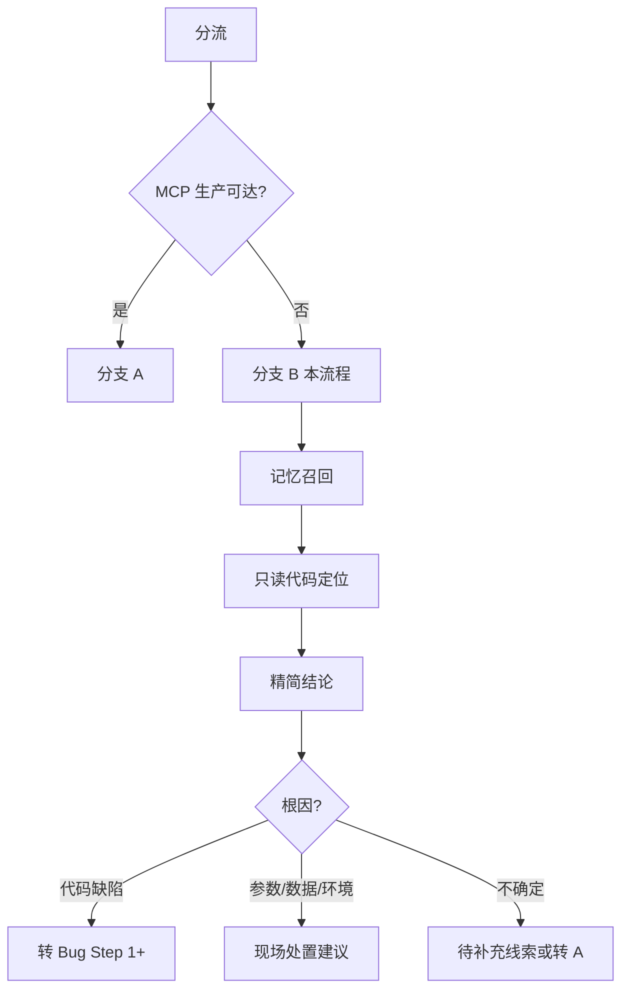

# 现场离线排查流程（库不可达）

> **现场生产库 / MCP 生产不可达时必读。** 凭截图、报错等做**只读代码逻辑分析**；**验证前不改代码**。  
> 有 traceId 且 MCP 可达 → [workflow 分支 A](../workflow.md#分支-a生产排查mcp--traceid-可达) + `his-log-diagnosis`。  
> **记忆召回 / 精简输出 / 沉淀** → 统一见 [workflow 排查类共用约定](../workflow.md#排查类共用约定分支-a--b)。

---

## 与 workflow 的关系

| 场景 | 链路 | 改代码 |
|------|------|--------|
| 新功能 / Bug | workflow Step 1–13 | 人审后 |
| traceId + MCP 生产 | **分支 A** | 否 |
| **现场库不可达** | **本文件（分支 B）** | 否 |
| 确认代码缺陷 | 转 workflow **Bug 修复** | 人审后 |



---

## 执行要点（Agent 内部，勿逐步汇报）

### 0. 分流确认

| 检查 | 离线适用 |
|------|----------|
| 生产库 / VPN / MCP 生产 **不可达** | ✅ |
| 目的是「先搞清楚原因」 | ✅ |
| 有 traceId 且 MCP 可查 | ❌ → **分支 A** |
| 用户已要求「审查通过改代码」 | ❌ → **workflow Bug** |

**硬约束：** 禁止 commit / 改业务代码 / 生产写 SQL；禁止 MCP `get_code`（用工作区 Read/Grep）。

### 1. 记忆召回

按 [workflow 排查记忆召回](../workflow.md#记忆召回排查专用)：

1. 用户 `@` case 或线索  
2. `docs/memory/index.md` → 最多 2 个 case 摘要  
3. `docs/memory/business-rules.md` 相关约束（池表/预交金等）  
4. 在线（可选）：IMA 问题排查，≤3 条  

**不建** `short-term/`。

### 2. 只读代码定位

从线索 → 页面 `pages/` → API → `Controller → Service → Dao → *Dao.xml`。

子仓库在工作区根目录，直接 Read/Grep（映射见 Skill `zoehis-code-map`）。  
读出：**关键条件分支、状态过滤、参数默认值**——这是离线排查的核心产出。

| 域 | 常用后端仓 |
|----|------------|
| 收费 | `onelink-micro-charge-fj-common` |
| 医嘱 | `onelink-micro-pres-fj-common` |
| 基础 | `onelink-micro-optimus-fj-common` |
| 医保 | `onelink-micro-insurance-fj-ybcommon` |

### 3. 结论（一次回复，见 workflow 输出上限）

```markdown
## 离线排查结论

**结论**：（≤30 字）

**证据**（3–5 条）
1. …

**代码链路**（≤5 行表或 ≤15 行关键片段）
| 仓库 | 路径 | 说明 |

**可能断点**（条件不满足 → 现象）

**现场建议**（≤3 条：参数核对 / 版本 diff / 界面操作验证）

**数据核对**（若需要，每项一行，不写 SQL 脚本）
- 表 `XXX` 字段 `YYY`，条件 …，预期 …

**待补充线索**
- …

**后续**：转 Bug / 补充线索 / MCP 恢复后转分支 A
```

**判断原则：**

- 「按钮不显示 / 流程走错 / 计算不对 / 异步覆盖」→ **代码逻辑分析**  
- 「数据对不上」→ 代码里找过滤条件 + **一行**数据核对描述，**不写 SELECT 脚本包**  
- 用户已排除后端 → 只做前端/参数分析  

### 4. 后续分流

| 结果 | 下一步 |
|------|--------|
| 参数 / 配置 / 数据 | 现场处置；**不改 Agent 侧代码** |
| 确认代码缺陷 | 转 workflow **Bug 修复**，附排查证据 |
| 仍不确定 | 补 Network/traceId；MCP 恢复 → **分支 A** |
| 可复用模式 | 用户确认后 → `his-log-diagnosis/cases.md`（**不写** `docs/memory/cases/`） |

---

## 开场模板

```text
请按 docs/排查/现场离线排查流程.md + workflow 排查类共用约定执行。
一次回复给结论，不要逐步勾选进度清单，不要输出 SELECT 脚本包。

【任务类型】现场离线排查
【记忆召回】本地 / 在线 / 全部
【页面/现象】
【线索】截图 / 报错 / @case / release 分支 / 单号 / eventNo
【约束】验证前不改代码
```

**MCP 恢复：** `MCP 已可达，traceId：____，改走分支 A。`

**转开发：** `离线排查已确认需改代码，按 workflow Bug 修复 Step 1；证据：…`

---

*版本：2026-07-09 | 权威：`docs/排查/现场离线排查流程.md` | 共用约定：`docs/workflow.md`*
