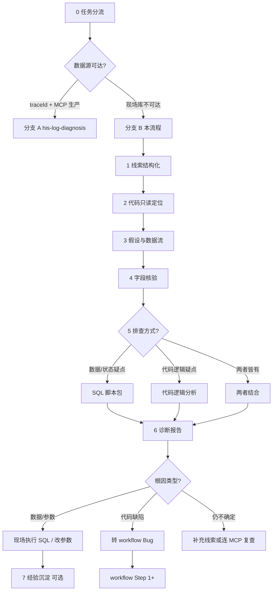

# 现场离线排查流程（库不可达）

> **现场生产库 / MCP 生产数据源不可达时必读。** Agent 凭截图、报错、界面字段等线索做**只读分析**，产出代码逻辑分析或排查 SQL 与处置建议；**验证前不改代码**。  
> 有 traceId 且 MCP 可达 → 改走 [workflow.md 分支 A](../workflow.md#分支-a生产排查不走改码流程) + Skill `his-log-diagnosis`。  
> 规范：`.cursor/rules/zoehis-*.mdc`；表名前缀见 Rule `zoehis-db-tables`、`zoehis-business`。

---

## 进度清单（Agent 每步完成后勾选汇报）

```
现场离线排查进度:
- [ ] 0. 任务分流（离线排查 / 可连 MCP / 需转改码）
- [ ] 1. 线索结构化（截图、报错、业务上下文）
- [ ] 2. 记忆库 + 代码只读定位（页面 → API → Dao → 表）
- [ ] 3. 数据流还原与排查假设（待证伪项清单）
- [ ] 4. 字段核验（MCP 测试库 get_table_schema；无 MCP 则标待现场核对）
- [ ] 5. 产出排查方案（代码逻辑分析 / SQL 脚本包 / 两者结合）
- [ ] 6. 结论与处置建议（数据 / 参数 / 配置 / 代码 / 环境）
- [ ] 7. 后续分流（现场执行 → 是否转 Bug 流程 / 经验沉淀）
```

---

## 与 workflow 的关系

| 场景 | 走哪条链路 | 是否改代码 |
|------|------------|------------|
| 新功能 / Bug 开发 | [workflow.md](../workflow.md) Step 0–13 | 是（人审后） |
| 生产 traceId + MCP 可达 | workflow **分支 A** + `his-log-diagnosis` | **否**（验证前） |
| **现场库不可达、凭截图排查** | **本文件（分支 B）** | **否** |
| 离线排查已确认代码缺陷 | 转 workflow **Bug 修复**（从 Step 1 起） | 人审后 |



---

## Step 0 — 任务分流

**Agent 必须确认：**

| 检查项 | 离线排查适用 |
|--------|--------------|
| 现场生产库 / VPN / MCP 生产 `dataSourceId` **不可达** | ✅ |
| 用户目的是「先搞清楚原因」，不是「直接改功能」 | ✅ |
| 有 traceId 且 MCP 生产日志/SQL 可查 | ❌ → **分支 A** |
| 用户已明确「审查通过改代码」 | ❌ → **workflow Bug** |

**硬约束：**

- 本流程 **禁止** `commit` / 改业务代码 / 对生产库 `INSERT`/`UPDATE`/`DELETE`
- **禁止使用 MCP `get_code` 工具**；代码定位直接读取当前工作区文件（`Read`/`Grep`/`Glob`/`SearchCodebase`）
- 交给现场的 SQL **默认仅 SELECT**；写操作须单独标注风险并由现场 DBA/负责人确认
- 表名、列名 **不得编造**；未从代码或 MCP `get_table_schema` 确认时，SQL 中加 `-- 待现场核对列名`

---

## Step 1 — 线索结构化

从用户提供的材料中提取并列表输出（缺项列入 **待补充线索**）：

### 1.1 必填上下文

| 字段 | 示例 | 用途 |
|------|------|------|
| 医院 / 项目 | 【漳州二院】 | 对齐 release 分支与项目参数 |
| 页面 / 菜单 | 住院结算、单据扣费 | 代码定位 |
| 现象 | 点击保存报错 xxx | 假设方向 |
| 期望 vs 实际 | 应扣预交金但未扣 | 数据流断点 |
| 发生时间 | 2026-06-15 14:30 左右 | 日志 / 流水时间窗 |
| 门诊 / 住院 | 住院 | `_OUTP_` / `_INP_` 表选择 |

### 1.2 截图 / 报错解析清单

从截图中尽量提取（OCR 或用户口述）：

- [ ] **患者标识**：姓名、住院号/门诊号、`eventNo`、卡号、`patientId`
- [ ] **单据 / 流水号**：申请单号、处方号、结算号、traceId、池表单号
- [ ] **界面字段值**：状态下拉、数量、金额、科室、操作员
- [ ] **报错原文**：弹窗全文、HTTP 状态、后端 `message` / 业务码
- [ ] **浏览器 Network**（若有）：请求 URL、入参 JSON、响应 `code`/`msg`
- [ ] **版本线索**：前端 tag、后端 jar 版本、发布日期（本地 release 分支或工作区代码）

**Agent 输出：**「线索表」+「待补充线索」（缺 `patientId`/`eventNo` 时说明哪些 SQL 无法精确执行）。

---

## Step 2 — 记忆库 + 代码只读定位

与 [workflow Step 2](../workflow.md#step-2--代码定位) 相同手段，但 **只读、不改文件**：

1. Read [docs/memory/index.md](../memory/index.md) → 相关 case
2. Read [docs/memory/business-rules.md](../memory/business-rules.md) → 池表/预交金/审核人等约束
3. 用户线索 → 页面 `pages/`、API `api/`、后端 `Controller → Service → Dao → *Dao.xml`
4. **读出**列表/保存/执行接口对应的 **WHERE 条件、状态字段、JOIN 表**

**Agent 必须输出：**

- 代码地图（仓库、路径、方法、**置信度**）
- 记忆库命中（case 链接 + 可复用结论）
- 本问题涉及的 **核心表**（MASTER/DETAIL/POOL/RECORD/预交金/流水）
- 关键 **状态码 / 字典项**（从代码或字典表 SQL 来，不臆造）

---

## Step 3 — 数据流还原与排查假设

按 Rule `zoehis-business` 画出简化数据流，并列出 **待证伪假设**（每条对应 Step 5 的一条或多条 SQL）：

```text
示例（单据扣费）:
  申请 POOL → 执行 → RECORD + 删 POOL → CHA_INP_CHARGE_DETAIL → 预交金 CONSUME
假设:
  H1. 池表仍有数据 → 执行未完成
  H2. 池表无、RECORD 无 → 未发送/未申请
  H3. 有费用无消费流水 → 扣费链路中断
  H4. 状态字段不符代码过滤条件 → 列表不显示但库里有
```

**Agent 必须输出：**

- 数据流（文字或箭头，标明 `_OUTP_`/`_INP_`）
- 假设清单 H1…Hn（优先级排序）
- 每条假设的 **验证方式**（SQL 查询 / 代码逻辑分析 / 两者结合）

---

## Step 4 — 字段核验

| 条件 | 动作 |
|------|------|
| MCP 测试库可用 | `get_table_schema(tableNamePattern)` 核对 Step 2 涉及表的列名 |
| MCP 不可用 | 从 `*Dao.xml` / 实体类提取列名，SQL 注释 `-- 列名来源：XxxDao.xml` |
| 列名仍存疑 | 不出具带该列的精确 SQL，改为「请现场 `DESC 表名` 后替换下列占位符」 |

**Agent 必须输出：** MCP 核验摘要，或「未核验，以下 SQL 含占位符」。

---

## Step 5 — 产出排查方案

### 5.0 排查方式选择（Agent 根据问题类型判断）

| 问题类型 | 排查方式 | 示例 |
|----------|----------|------|
| **数据状态疑点** | SQL 脚本包 | 池表残留、预交金余额异常、状态字段不符 |
| **代码逻辑疑点** | 代码逻辑分析 | 条件分支遗漏、状态码判断错误、参数默认值问题 |
| **两者皆有** | 代码分析 + SQL 脚本 | 逻辑有分支 + 需确认数据走向 |
| **参数/配置疑点** | 参数核对清单 | 系统参数、页面开关、字典项 |

**判断原则：**
- 问题描述涉及「数据不对」「库里查不到」「状态异常」→ **优先 SQL**
- 问题描述涉及「按钮不显示」「流程走错」「计算结果不对」→ **优先代码逻辑分析**
- 不确定时 → **两者结合**，先代码分析定位关键点，再出针对性 SQL

### 5.1 方式 A：代码逻辑分析（无需 SQL）

适用于大部分代码逻辑查询类问题，Agent 输出：

1. **关键代码片段**：从 Service/Dao.xml 中读出相关逻辑，标注关键条件分支
2. **逻辑流程图**：用文字或伪代码描述执行路径
3. **可能断点**：指出哪些条件不满足会导致当前现象
4. **验证建议**：让现场在界面操作时注意哪些字段值、日志输出

```text
示例（按钮不显示）:
  代码链路: page.vue → api.getList() → Controller → Service.queryList()
  关键条件: Service 第 42 行 if (status == '1') 过滤
  可能断点: 库里 status = '0' 被过滤掉
  验证建议: 请现场在数据库执行 SELECT status FROM xxx WHERE ... 确认值
```

### 5.2 方式 B：SQL 脚本包（数据排查）

#### 5.2.1 编写原则

1. **仅 SELECT**（交给现场 DBA 在只读账号或导出结果）
2. 使用 **绑定变量 / 占位符**，脚本顶部注释填写说明
3. 每条 SQL 注释：**验证哪条假设、预期结果、异常时含义**
4. 大表加 **时间范围 + 主键**，避免全表扫描
5. 达梦/Oracle 语法；团队若用其他库，现场替换函数（如 `NVL`/`COALESCE`）
6. 涉及金额、数量用表字段，不在 SQL 里做未确认的业务计算

#### 5.2.2 脚本包结构（Agent 按此模板输出）

```sql
-- ============================================================
-- 现场排查脚本 | 禅道/工单：________ | 页面：________
-- 项目：【漳州二院】 | 生成日期：YYYY-MM-DD
-- 使用前请替换：:PATIENT_ID :EVENT_NO :APPLY_NO :BEGIN_TIME :END_TIME
-- 约束：仅 SELECT；禁止在生产库直接 UPDATE/DELETE
-- ============================================================

-- ---------- 0. 患者与在院/就诊上下文 ----------
-- 验证：患者是否存在、是否在院、eventNo 是否一致
SELECT patient_id, inp_case_no, event_no, in_hospital_status_code, dept_code, bed_no
FROM pat_in_hospital
WHERE event_no = :EVENT_NO;  -- 或 inp_case_no = :INP_CASE_NO

-- ---------- 1. 假设 H1：池表是否残留 ----------
-- 预期：问题为「未执行完」时应能查到 POOL；已执行应无 POOL 有 RECORD
-- 表名按业务替换 APP_INP_APPLY_SHEET_POOL / APP_INP_LAY_DRUG_POOL 等
SELECT apply_no, patient_id, event_no, apply_status, apply_time, item_code, quantity
FROM app_inp_apply_sheet_pool
WHERE event_no = :EVENT_NO
  AND apply_time >= :BEGIN_TIME;

-- ---------- 2. 假设 H2：正式记录与费用 ----------
SELECT charge_detail_no, event_no, item_code, quantity, price, charge_time, charge_status
FROM cha_inp_charge_detail
WHERE event_no = :EVENT_NO
  AND charge_time >= :BEGIN_TIME
ORDER BY charge_time DESC;

-- ---------- 3. 假设 H3：预交金账户与消费流水 ----------
SELECT account_balance, account_status FROM cha_inp_prepay_acct WHERE event_no = :EVENT_NO;

SELECT consume_no, event_no, consume_money, consume_time, consume_type
FROM cha_inp_prepay_consume_master
WHERE event_no = :EVENT_NO
  AND consume_time >= :BEGIN_TIME
ORDER BY consume_time DESC;

-- ---------- 4. 系统参数 / 页面开关（若为参数类问题）----------
SELECT param_english_name, param_value, org_id
FROM com_sys_param
WHERE param_english_name IN ('param_name_from_code');  -- 从代码 sysParamService.getSysParam 提取

-- ---------- 5. 字典项（界面下拉与库值是否一致）----------
SELECT dict_name, value_code, value_name, valid_flag
FROM com_dict_detail
WHERE dict_name = :DICT_NAME
  AND value_code = :VALUE_FROM_SCREEN;
```

#### 5.2.3 按业务域速查（表名替换参考）

| 域 | 常见主键线索 | 优先查表（示例） |
|----|--------------|------------------|
| 住院医嘱/申请 | `eventNo`, 申请单号 | `PRES_APPLY_RECORDS_POOL`, `APP_INP_*_POOL` / `*_RECORDS` |
| 门诊处方 | `presNo`, `eventNo` | `PRES_OUTP_PRES_MASTER/DETAIL`, 摆药池 `APP_OUTP_LAY_DRUG_POOL` |
| 收费/扣费 | 结算号、费用明细号 | `CHA_*_CHARGE_DETAIL`, `CHA_*_SETTLE_MASTER` |
| 预交金 | `eventNo` | `CHA_*_PREPAY_ACCT`, `*_PREPAY_RECORD`, `*_PREPAY_CONSUME_*` |
| 住院状态/审核 | `eventNo` | `PAT_IN_HOSPITAL`, `PAT_ADMISSION_RECORD`（如 `FEE_AUDIT_FLAG`） |
| 医保 | 结算 id | `INS_*_SETTLE_MASTER`, 交易日志表 |

具体表名以 Step 2 读到的 Dao.xml 为准，上表仅作索引。

### 5.3 非 SQL 建议（与排查方案并列给出）

| 类型 | 建议 |
|------|------|
| **参数** | 让现场查 `COM_SYS_PARAM` 或参数维护界面；对照代码默认值 |
| **页面参数** | 提供 `configId` + key（来自 `$getPageControlMap`），请现场在页面参数维护核对 |
| **缓存** | 是否需清字典缓存、重登、换浏览器（代码有本地 cache 时） |
| **版本** | 对照 release tag 与 GitLab 该 tag 下相关文件是否含修复 commit |
| **权限** | 操作员科室、角色与数据 `dept_code` / 权限 SQL 过滤 |
| **并发** | 是否重复点击、单据已被他人执行（查操作员与时间戳） |

---

## Step 6 — 诊断报告（Agent 必须给出）

```markdown
## 现场离线诊断报告

### 问题摘要
- 页面：
- 现象：
- 项目：

### 线索摘要
| 项 | 值 |
|----|-----|
| patientId / eventNo | |
| 单号 / traceId | |
| 报错原文 | |

### 代码链路（只读）
| 仓库 | 路径 | 说明 | 置信度 |
|------|------|------|--------|

### 数据流与假设
（H1…Hn + 预期）

### 排查方案
（代码逻辑分析 / SQL 脚本包 / 两者结合，按 Step 5 选择的方式输出）

### 字段核验
- 已 get_table_schema：… / 未核验占位符：…

### 初步结论（待现场验证）
| 根因类型 | 可能性 | 依据 |
|----------|--------|------|
| 数据状态 | 高/中/低 | |
| 参数配置 | | |
| 代码缺陷 | | |
| 环境/版本 | | |

### 现场处置建议
1. 按排查方案执行（代码分析结论 / SQL 节 0→n），将结果截图回传
2. 若 H1 成立：…（仅描述，不写未授权的 UPDATE）
3. 若确认代码问题：转 Bug，禅道补充排查结果

### 待补充线索
1. …

### 风险与禁忌
- 生产库禁止 Agent 远程写操作
- 任何数据修复须现场按变更流程执行
```

---

## Step 7 — 后续分流

| 排查结果 | Agent / 用户下一步 |
|---------------|-------------------|
| 数据状态不符业务规则 | 现场评估是否手工修复；**仍不改 Agent 侧代码** 直至用户发起 Bug/需求 |
| 参数错误 | 现场改参数；必要时补参数 jsonl 走 workflow 单独 commit |
| 确认代码逻辑错误 | 复制 [workflow 开场模板](../workflow.md#需求开场模板)，类型选 **Bug 修复**，附上排查证据 |
| 仍无法定论 | 补充 Network/traceId；若 MCP 恢复 → **分支 A** |
| 可复用 | 个人 Skill `his-log-diagnosis/cases.md` 或 `docs/memory/cases/`（排查类选前者；若后续改码则 Step 12 写后者） |

---

## 规范与工具速查

| 用途 | 位置 |
|------|------|
| 开发主流程 | [docs/workflow.md](../workflow.md) |
| MCP 可达生产排查 | 分支 A + `his-log-diagnosis` |
| 业务表流转 | `.cursor/skills/zoehis-ai-dev/patterns/his-business-patterns.md` |
| 表结构（测试库） | MCP `user-zoe-his-mcp` → `get_table_schema` |
| 长期记忆 | [docs/memory/index.md](../memory/index.md) |
| 返工（测试不通过） | [docs/返工/返工流程.md](../返工/返工流程.md) |

---

## 开场模板（复制给 Agent）

```text
请严格按 docs/排查/现场离线排查流程.md 执行，逐步汇报进度清单。
禁止改代码、禁止 git 写操作、禁止对生产库写 SQL。

【任务类型】现场离线排查
【页面/菜单】
【期望处理方式（代码逻辑分析 / sql排查脚本 / 两者结合 / 临时处理建议）】
【现象】（实际 vs 期望）
【发生时间】

【已知线索】
- 截图：（描述或 @ 图片）
- 报错原文：
- 患者：姓名 / 住院号 / eventNo / patientId（能填多少填多少）
- 单号：处方/申请/结算/…
- Network 请求：（可空）
- 前端/后端版本：（可空）

【约束】
- 现场库不可达，请根据问题类型选择排查方式（代码逻辑分析 / SQL 脚本 / 两者结合）
- 表名列名不确定时用 MCP 测试库 get_table_schema 或标待核对
- 结论需代码 + 数据假设交叉验证，验证前不改代码
```

**MCP 恢复后追加：**

```text
MCP 已可达，traceId：________，请改走 workflow 分支 A 复核。
```

**确认代码问题后转开发：**

```text
离线排查已确认需改代码，请按 docs/workflow.md Bug 修复流程，从 Step 1 开始；
【排查证据】…
【根因】…
```

---

*版本：2026-06-17 | 权威执行文档：`docs/排查/现场离线排查流程.md` | 主流程：`docs/workflow.md`*
