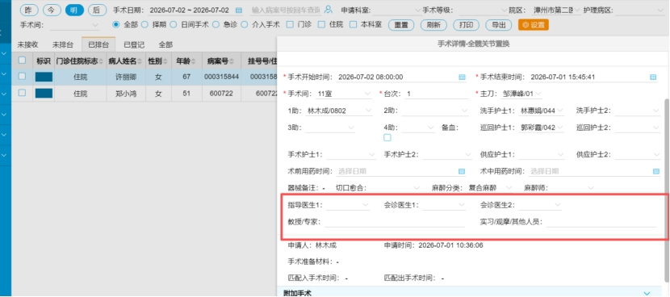

请按 docs/prompt_external.md 与 docs/workflow.md 的 Step 0–4 执行，逐步汇报进度。
禁止改代码、禁止 git pull/commit/push。
【约束】
- 只输出初步分析(必做)，最终 spec 与实现在 Cursor 完成
- 遵守 .cursor/rules/zoehis-*.mdc（Read 仓库内文件，不要猜测表名/接口）
- Step 4 按 .cursor/skills/zoehis-code-map/SKILL.md 产出代码地图
- 检索 docs/memory/index.md 找类似 case
- 分析结果写入 docs/memory/short-term/{禅道号}-{功能描述}+{关键索引}.md
【任务类型】功能修改
【需求描述】
手术导航这些字段需要提前到手术申请单填写 非必填；新增页面参数控制

【已知线索（优先考虑】
可参考类似改造
docs\memory\cases\205369-手术申请扩展字段+EAV-PRES_OPERATION_APPLY_DETAIL.md
【疑似线索，用于推理提示】

【禅道&项目】
禅道ID：206668
项目：漳州二院
【需求补充】

【记忆召回机制（本地/在线/全部）】
全部
