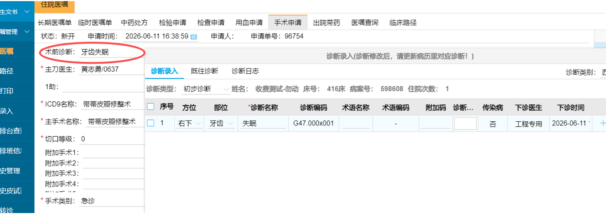

【任务类型】功能改造
【需求描述】

术前诊断显示优化  显示：方位+部位+诊断名称，目前缺少方位
【线索】
页面：医嘱-手术申请
可召回记忆 202858 | 住院/手术申请 | 术前诊断、方位、preopDiags、operationApplication、父子组件同步 | [cases/202858-手术申请术前诊断方位同步+preopDiags-operationApplication.md](cases/202858-手术申请术前诊断方位同步+preopDiags-operationApplication.md)